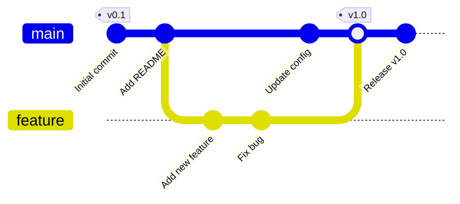
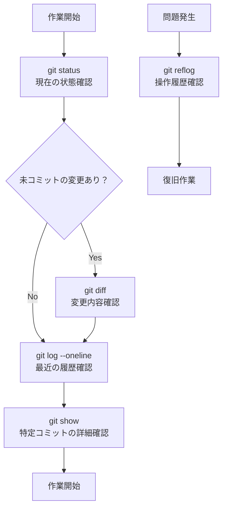

# 01. 確認系コマンド - Git の状況を把握する

Git で作業をする際に、現在の状況を把握するために使用する基本的なコマンドについて説明します。

## 📋 目次

- [git status - 作業ツリーの状態確認](#git-status---作業ツリーの状態確認)
- [git log - コミット履歴の表示](#git-log---コミット履歴の表示)
- [git diff - 変更差分の表示](#git-diff---変更差分の表示)
- [git show - 特定コミットの詳細表示](#git-show---特定コミットの詳細表示)
- [git reflog - 操作履歴の確認](#git-reflog---操作履歴の確認)

---

## git status - 作業ツリーの状態確認

### 📖 概要
現在の作業ディレクトリとステージングエリアの状態を表示します。

### 💡 基本的な使い方

```bash
# 基本的な状態確認
git status

# 短縮形式で表示
git status -s
git status --short

# ブランチ情報も含めて表示
git status -b
git status --branch
```

### 📝 表示される情報

```
On branch main
Your branch is up to date with 'origin/main'.

Changes to be committed:
  (use "git reset HEAD <file>..." to unstage)
        modified:   README.md

Changes not staged for commit:
  (use "git add <file>..." to update what will be committed)
  (use "git checkout -- <file>..." to discard changes in working directory)
        modified:   config.json

Untracked files:
  (use "git add <file>..." to include in what will be committed)
        new-feature.py
```

#### ファイルの状態の意味：
- **Changes to be committed**: ステージング済み（次のコミットに含まれる）
- **Changes not staged for commit**: 変更されているがステージングされていない
- **Untracked files**: Git で追跡されていない新しいファイル

---

## git log - コミット履歴の表示

### 📖 概要
リポジトリのコミット履歴を表示します。様々なオプションで表示形式をカスタマイズできます。

### 💡 基本的な使い方

```bash
# 基本的なログ表示
git log

# 各コミットあたり1行で簡潔に表示
git log --oneline

# 直近5コミット
git log --oneline -5

# グラフ形式で表示（ブランチの分岐が見やすい）
git log --graph --oneline

# 詳細な統計情報付き（qで終了）
git log --stat

# 変更内容も含めて表示（qで終了）
git log -p
git log --patch

# 最新のN件のみ表示（qで終了）
git log -5
git log -n 5

# 特定期間のログ
git log --since="2024-01-01" --until="2024-12-31"
git log --after="1 week ago"

# 特定の作者のコミット
git log --author="山田太郎"

# 特定ファイルの変更履歴
git log filename.txt
```

### 🎨 カスタムフォーマット

```bash
# 美しいグラフ表示（エイリアス推奨）
git log --graph --pretty=format:'%Cred%h%Creset -%C(yellow)%d%Creset %s %Cgreen(%cr) %C(bold blue)<%an>%Creset' --abbrev-commit

# 簡潔な形式
git log --pretty=format:"%h - %an, %ar : %s"
```

### 📊 Mermaid グラフで見るコミット履歴



---

## git diff - 変更差分の表示

### 📖 概要
ファイルの変更内容を詳細に表示します。

### 💡 基本的な使い方

```bash
# 作業ディレクトリとステージングエリアの差分
git diff

# ステージングエリアと最新コミットの差分
git diff --staged
#git diff --cached # older name of --staged

# 作業ディレクトリと最新コミットの差分
git diff HEAD

# 特定のファイルの差分
git diff filename.txt

# コミット間の差分
git diff commit1 commit2
git diff HEAD~1 HEAD

# ブランチ間の差分
git diff main feature-branch

# 統計情報のみ表示
git diff --stat

# 差分を単語単位で表示
git diff --word-diff
```

### 📋 diff 出力の読み方

```diff
diff --git a/README.md b/README.md
index 1234567..abcdefg 100644
--- a/README.md
+++ b/README.md
@@ -1,4 +1,6 @@
 # プロジェクトタイトル
 
-これは古い説明です。
+これは新しい説明です。
+
+新しい機能を追加しました。
 
 ## インストール方法
```

- `---` : 変更前のファイル
- `+++` : 変更後のファイル
- `-` : 削除された行
- `+` : 追加された行
- ` ` : 変更されていない行

---

## git show - 特定コミットの詳細表示

### 📖 概要
特定のコミット、タグ、ブランチの詳細な情報を表示します。

### 💡 基本的な使い方

```bash
# 最新コミットの詳細
git show

# 特定コミットの詳細
git show commit-hash
git show HEAD~1

# 特定ファイルの特定コミットでの状態
git show commit-hash:filename.txt

# コミットの統計情報のみ
git show --stat

# コミットメッセージのみ
git show --pretty=format:"%s" --no-patch

# 特定タグの詳細
git show v1.0.0
```

### 📝 show 出力例

```
commit a1b2c3d4e5f6789... (HEAD -> main, origin/main)
Author: 山田太郎 <yamada@example.com>
Date:   Mon Oct 28 14:30:00 2024 +0900

    新機能: ユーザー認証機能を追加

    - ログイン画面の実装
    - セッション管理の追加
    - パスワードのハッシュ化

diff --git a/auth.py b/auth.py
new file mode 100644
index 0000000..1234567
--- /dev/null
+++ b/auth.py
@@ -0,0 +1,25 @@
+def login(username, password):
+    # ログイン処理
...
```

---

## git reflog - 操作履歴の確認

### 📖 概要
Git で行った操作の履歴を表示します。`git reset` や `git rebase` で失われたコミットを復旧する際に非常に重要です。

### 💡 基本的な使い方

```bash
# 操作履歴の表示
git reflog

# 特定ブランチの操作履歴
git reflog branch-name

# より詳細な情報
git reflog --pretty=fuller

# 最近のN件のみ表示
git reflog -5

# 期間を指定
git reflog --since="1 hour ago"
```

### 📝 reflog 出力例

```
a1b2c3d (HEAD -> main) HEAD@{0}: commit: 新機能を追加
b2c3d4e HEAD@{1}: pull: Fast-forward
c3d4e5f HEAD@{2}: checkout: moving from feature to main
d4e5f6g HEAD@{3}: commit: バグ修正
e5f6g7h HEAD@{4}: checkout: moving from main to feature
```

### 🔧 reflog を使った復旧例

```bash
# 間違って reset してしまった場合の復旧
git reset --hard HEAD@{1}

# 削除してしまったブランチの復旧
git checkout -b recovered-branch HEAD@{3}
```

---

## 🔍 git log と git reflog の違いと使い分け

- **`git log`**: リポジトリのコミット履歴を表示します。通常の履歴確認に使用され、現在のブランチや他のブランチのコミット履歴を確認するのに適しています。
  - **用途**: コミットの内容や履歴を確認する。
  - **例**: `git log --oneline` で簡潔な履歴を確認。

- **`git reflog`**: Git の操作履歴を表示します。`git reset` や `git rebase` などで失われたコミットを復旧する際に役立ちます。
  - **用途**: 操作履歴を確認し、失われたコミットやブランチを復旧する。
  - **例**: `git reflog` で HEAD の移動履歴を確認。

#### 使い分けのポイント
- **履歴の確認**: 通常のコミット履歴を確認したい場合は `git log` を使用。
- **復旧作業**: 誤操作で失われたコミットやブランチを復旧したい場合は `git reflog` を使用。

#### 実際の例

```bash
$ git log --oneline # commit関連しか表示されない
8b4dedf (HEAD -> main) --cached comment out
14d3b14 (origin/main) 読みづらさ解消
2f6d62d submodule url added
73058dd SETUP_GUIDE.md updated
9d07094 instruction updated
f0305bc Add practice directory as submodule
1a0cd68 Initial commit: Add Git learning documentation

$ git reflog # commit以外の作業履歴も残る
8b4dedf (HEAD -> main) HEAD@{0}: commit: --cached comment out
14d3b14 (origin/main) HEAD@{1}: commit: 読みづらさ解消
2f6d62d HEAD@{2}: commit: submodule url added
73058dd HEAD@{3}: commit: SETUP_GUIDE.md updated
9d07094 HEAD@{4}: Branch: renamed refs/heads/master to refs/heads/main
9d07094 HEAD@{6}: commit: instruction updated
f0305bc HEAD@{7}: commit: Add practice directory as submodule
1a0cd68 HEAD@{8}: commit (initial): Initial commit: Add Git learning documentation
```

---

## 🔍 状況確認の流れ

コミット履歴を理解するための推奨の確認手順：



## 💡 よく使う組み合わせコマンド

```bash
# 状況の全体把握
git status && git log --oneline -10

# 現在の変更とステージングの確認
git diff && git diff --staged

# 美しいログ表示（エイリアス設定推奨）
git log --graph --pretty=format:'%Cred%h%Creset -%C(yellow)%d%Creset %s %Cgreen(%cr) %C(bold blue)<%an>%Creset' --abbrev-commit -10
```

## 📚 次のステップ

確認系コマンドに慣れたら、次は [02. ブランチ操作系コマンド](02-branch-operations.md) に進みましょう.