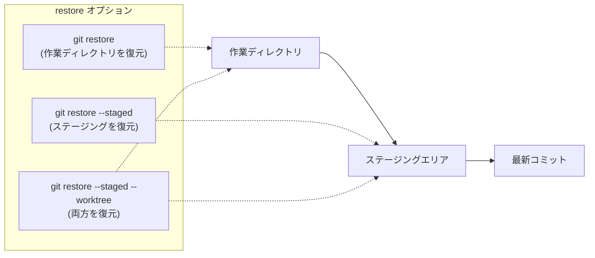
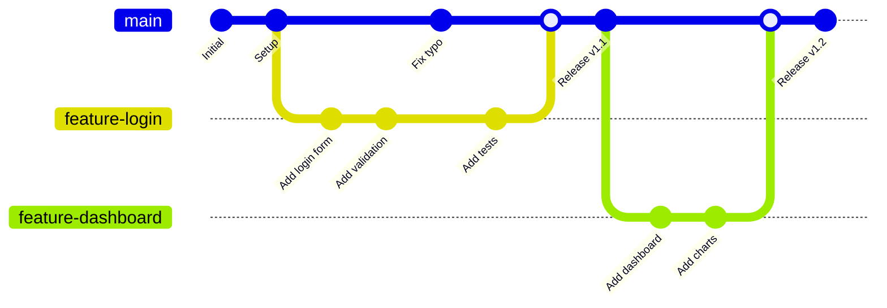
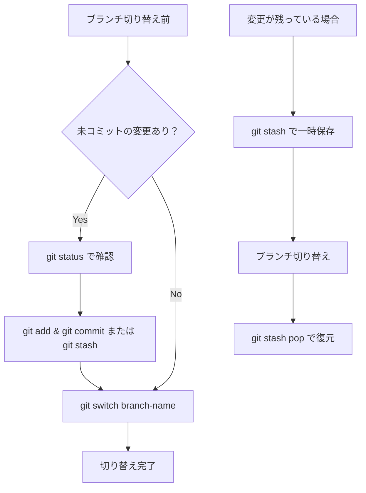

# 02. ブランチ操作系コマンド - ブランチの作成・切り替え・管理

Git におけるブランチ操作の基本的なコマンドについて説明します。ブランチは Git の最も強力な機能の一つです。

## 📋 目次

- [git branch - ブランチの管理](#git-branch---ブランチの管理)
- [git checkout - ブランチの切り替え（従来方式）](#git-checkout---ブランチの切り替え従来方式)
- [git switch - ブランチの切り替え（新方式）](#git-switch---ブランチの切り替え新方式)
- [git restore - ファイルの復元](#git-restore---ファイルの復元)
- [ブランチ戦略の基本](#ブランチ戦略の基本)

---

## git branch - ブランチの管理

### 📖 概要
ブランチの作成、一覧表示、削除、名前変更などを行います。

### 💡 基本的な使い方

```bash
# ブランチ一覧表示
git branch                 # ローカルブランチのみ
git branch -a             # すべてのブランチ（リモート含む）
git branch -r             # リモートブランチのみ

# ブランチ作成
# `git branch` と `git checkout -b` の違いについて:
# - `git branch`: ブランチを作成するだけで、作成後にそのブランチに切り替えません。
# - `git checkout -b`: ブランチを作成すると同時に、そのブランチに切り替えます。
#   そのため、作業をすぐに開始したい場合に便利です。

git branch new-feature    # 現在のコミットから新しいブランチを作成
# 例: git branch new-feature

git checkout -b new-feature    # 現在のコミットから新しいブランチを作成し、切り替え
# 例: git checkout -b new-feature

git branch new-feature commit-hash  # 特定のコミットから作成
# 例: git branch new-feature abc1234

git checkout -b new-feature commit-hash  # 特定のコミットから作成し、切り替え
# 例: git checkout -b new-feature abc1234

# ブランチ削除
git branch -d feature-branch    # マージ済みブランチの削除
git branch -D feature-branch    # 強制削除（未マージでも削除）

# ブランチ名変更
git branch -m old-name new-name     # 他のブランチの名前変更
git branch -m new-name             # 現在のブランチの名前変更

# 詳細情報付きで表示
git branch -v             # 最新コミット情報も表示
git branch -vv            # 追跡ブランチ情報も表示

# マージ状況の確認
git branch --merged       # マージ済みブランチ
git branch --no-merged    # 未マージブランチ
```

### 📝 出力例

```
* main                    # 現在のブランチ（*付き）
  feature-login
  feature-dashboard
  remotes/origin/main
  remotes/origin/develop
```

---

## git checkout - ブランチの切り替え（従来方式）

### 📖 概要
ブランチの切り替えやファイルの復元を行う多機能コマンドです。Git 2.23 以降は `git switch` と `git restore` に分離されました。

### 💡 基本的な使い方

```bash
# ブランチ切り替え
git checkout branch-name

# ブランチ作成と同時に切り替え
git checkout -b new-feature

# 特定のコミットからブランチ作成
git checkout -b new-feature commit-hash

# 特定のコミットに移動（detached HEAD状態）
git checkout commit-hash

# ファイルの復元（作業ディレクトリの変更を破棄）
git checkout -- filename.txt
git checkout HEAD -- filename.txt

# 前のブランチに戻る
git checkout -

# リモートブランチからローカルブランチ作成
git checkout -b local-branch origin/remote-branch
```

### ⚠️ 注意事項

`git checkout` は多機能すぎるため、以下の問題があります：

1. **混乱しやすい**: ブランチ切り替えとファイル復元が同じコマンド
2. **危険性**: 意図しないファイルの上書きが発生する可能性
3. **可読性**: コマンドの意図が分かりにくい

そのため、Git 2.23 以降では `git switch` と `git restore` の使用が推奨されています。

---

## git switch - ブランチの切り替え（新方式）

### 📖 概要
ブランチの切り替えに特化したコマンドです。`git checkout` のブランチ切り替え機能を分離したものです。

### 💡 基本的な使い方

```bash
# ブランチ切り替え
git switch branch-name

# ブランチ作成と同時に切り替え
git switch -c new-feature
git switch --create new-feature

# 特定のコミットからブランチ作成
git switch -c new-feature commit-hash

# 前のブランチに戻る
git switch -

# リモートブランチからローカルブランチ作成
git switch -c local-branch origin/remote-branch

# detached HEAD状態でコミットに移動
git switch --detach commit-hash
```

### ✅ git switch の利点

1. **明確な意図**: ブランチ切り替えのみに特化
2. **安全性**: ファイルの誤った上書きを防ぐ
3. **直感的**: コマンド名から動作が推測しやすい

### ✅ git switch と git checkout の違い

- **`git switch`**: ブランチの切り替えに特化したコマンドで、Git 2.23 以降に導入されました。ブランチ操作を明確にするために設計されています。
  - **利点**: 
    - ブランチ切り替えに特化しており、意図が明確。
    - ファイルの復元操作と混同することがない。
  - **例**: `git switch -c new-feature`（新しいブランチを作成して切り替え）

- **`git checkout`**: ブランチの切り替えやファイルの復元を行う多機能コマンドです。Git 2.23 以降では、`git switch` と `git restore` に分離されました。
  - **欠点**:
    - 多機能すぎて混乱を招く可能性がある。
    - ファイル復元とブランチ切り替えが同じコマンドで行われるため、意図しない操作が発生するリスクがある。
  - **例**: `git checkout -b new-feature`（新しいブランチを作成して切り替え）

#### 具体例とコマンド

1. **新しいブランチを作成して切り替える**
   - `git switch -c new-feature` を実行すると:
     - `new-feature` という新しいブランチが作成され、**自動的にそのブランチに切り替わります**。
     - すぐに `new-feature` ブランチで作業を開始できます。
   - `git checkout -b new-feature` を実行すると:
     - `new-feature` という新しいブランチが作成され、**自動的にそのブランチに切り替わります**。
     - 結果は `git switch -c` と同じですが、`checkout` は他の機能も持つため意図が不明確です。

2. **既存のブランチに切り替える**
   - `git switch feature-branch` を実行すると:
     - 現在のブランチから `feature-branch` に切り替わります。
     - ブランチ切り替え専用コマンドなので、**誤ってファイルを復元してしまう心配がありません**。
   - `git checkout feature-branch` を実行すると:
     - 現在のブランチから `feature-branch` に切り替わります。
     - ただし、`git checkout filename.txt` のようにファイル名を指定すると**ファイルの復元**になってしまうため、**タイプミスで意図しない操作をする危険があります**。

3. **リモートブランチからローカルブランチを作成して切り替える**
   - `git switch -c local-branch origin/remote-branch` を実行すると:
     - リモートの `origin/remote-branch` を元に `local-branch` が作成され、そのブランチに切り替わります。
     - 自動的にリモートブランチを追跡するように設定されます。
   - `git checkout -b local-branch origin/remote-branch` を実行すると:
     - リモートの `origin/remote-branch` を元に `local-branch` が作成され、そのブランチに切り替わります。
     - 結果は `git switch -c` と同じですが、新しいコマンドの方が意図が明確です。

4. **特定のコミットに移動（detached HEAD 状態）**
   - `git switch --detach commit-hash` を実行すると:
     - 指定したコミットに移動し、**detached HEAD 状態**になります。
     - `--detach` オプションを明示的に指定するため、**意図的に detached HEAD 状態になることが明確**です。
   - `git checkout commit-hash` を実行すると:
     - 指定したコミットに移動し、**detached HEAD 状態**になります。
     - ただし、オプションなしで detached HEAD になるため、**意図せず detached HEAD 状態になってしまう可能性があります**。

#### 🔍 どちらを使うべきか？

- **`git switch` と `git restore` の使用を推奨**（Git 2.23 以降）
  - ブランチ操作とファイル操作が明確に分離されている
  - タイプミスによる誤操作のリスクが低い
  - コマンドの意図が一目でわかる

- **`git checkout` を使う場合**
  - Git 2.23 より古いバージョンを使用している場合
  - 既存のスクリプトやドキュメントとの互換性が必要な場合

---

## git restore - ファイルの復元

### 📖 概要
ファイルの復元に特化したコマンドです。`git checkout` のファイル復元機能を分離したものです。

### 💡 基本的な使い方

```bash
# 作業ディレクトリのファイルを復元（変更を破棄）
git restore filename.txt

# 複数ファイルの復元
git restore file1.txt file2.txt

# すべてのファイルを復元
git restore .

# ステージングエリアからファイルを復元（unstage）
git restore --staged filename.txt

# 特定のコミットからファイルを復元
git restore --source=commit-hash filename.txt
git restore --source=HEAD~1 filename.txt

# ステージングエリアと作業ディレクトリの両方を復元
git restore --staged --worktree filename.txt
```

### 📊 restore の動作パターン



### ✅ git restore と git checkout の違い

- **`git restore`**: ファイルの復元に特化したコマンドで、Git 2.23 以降に導入されました。ファイル操作を明確にするために設計されています。
  - **利点**: 
    - ファイルの復元に特化しており、意図が明確。
    - ブランチ切り替えと混同することがない。
    - オプションで作業ディレクトリとステージングエリアを明確に指定できる。
  - **例**: `git restore --staged filename.txt`（ステージングを取り消す）

- **`git checkout`**: ブランチの切り替えやファイルの復元を行う多機能コマンドです。Git 2.23 以降では、`git switch` と `git restore` に分離されました。
  - **欠点**:
    - 多機能すぎて混乱を招く可能性がある。
    - ブランチ切り替えとファイル復元が同じコマンドで行われるため、意図しない操作が発生するリスクがある。
  - **例**: `git checkout -- filename.txt`（ファイルの変更を破棄）

#### 具体例とコマンドの違い

1. **作業ディレクトリの変更を破棄する**
   - `git restore filename.txt` を実行すると:
     - `filename.txt` の作業ディレクトリ上の変更が破棄され、**最後にコミットまたはステージングした状態に戻ります**。
     - コマンド名から「復元」という意図が明確です。
   - `git checkout -- filename.txt` を実行すると:
     - `filename.txt` の作業ディレクトリ上の変更が破棄され、最後にコミットした状態に戻ります。
     - ただし、`--` を忘れると**ブランチ切り替えと誤認される可能性があります**（例: `git checkout filename.txt` というブランチ名があると混乱します）。

2. **ステージングを取り消す（unstage）**
   - `git restore --staged filename.txt` を実行すると:
     - `filename.txt` のステージング（`git add` した状態）が取り消され、**作業ディレクトリの変更は残ります**。
     - `--staged` オプションで対象が明確です。
   - `git checkout HEAD -- filename.txt` を実行すると:
     - **ステージングと作業ディレクトリの両方の変更が破棄され**、最後のコミット状態に戻ります。
     - ステージングだけを取り消すことができず、**作業内容も失われるため危険**です。
   - 注: 従来は `git reset HEAD filename.txt` でステージングを取り消していましたが、`git restore --staged` の方が意図が明確です。

3. **特定のコミットからファイルを復元する**
   - `git restore --source=HEAD~1 filename.txt` を実行すると:
     - 1つ前のコミット（`HEAD~1`）から `filename.txt` の内容を取得し、**作業ディレクトリに復元します**。
     - ステージングエリアには影響しません（復元後に `git add` が必要）。
   - `git checkout HEAD~1 -- filename.txt` を実行すると:
     - 1つ前のコミットから `filename.txt` の内容を取得し、**作業ディレクトリとステージングエリアの両方に復元します**。
     - 自動的にステージングされるため、すぐにコミット可能な状態になります。

4. **ステージングと作業ディレクトリの両方を復元する**
   - `git restore --staged --worktree filename.txt` を実行すると:
     - `filename.txt` のステージングと作業ディレクトリの変更が**両方とも破棄され**、最後のコミット状態に戻ります。
     - `--staged` と `--worktree` の2つのオプションで**意図が明確**です。
   - `git checkout HEAD -- filename.txt` を実行すると:
     - `filename.txt` のステージングと作業ディレクトリの変更が両方とも破棄され、最後のコミット状態に戻ります。
     - 結果は同じですが、`HEAD` の指定が必須で、**オプションなしでは両方を復元することが不明確**です。

#### 🔍 どちらを使うべきか？

- **`git restore` の使用を推奨**（Git 2.23 以降）
  - ファイル操作の意図が明確
  - `--staged` と `--worktree` で対象を明示的に指定できる
  - ブランチ切り替えとの混同がない
  - タイプミスによる誤操作のリスクが低い

- **`git checkout` を使う場合**
  - Git 2.23 より古いバージョンを使用している場合
  - 既存のスクリプトやドキュメントとの互換性が必要な場合
  - ステージングと作業ディレクトリを同時に復元したい場合（ただし `git restore --staged --worktree` の方が明確）

---

## ブランチ戦略の基本

### 🌳 基本的なブランチフロー



### 🔄 一般的なブランチ操作の流れ

```bash
# 1. 新機能の開発開始
git switch main                    # mainブランチに移動
git pull origin main              # 最新の状態に更新
git switch -c feature-new-login   # 新しい機能ブランチ作成

# 2. 開発作業
# ファイルを編集...
git add .
git commit -m "Add new login feature"

# 3. 定期的にmainの変更を取り込み
git switch main
git pull origin main
git switch feature-new-login
git merge main                    # または git rebase main

# 4. 機能完成後
git switch main
git merge feature-new-login       # 機能ブランチをマージ
git branch -d feature-new-login   # 不要になったブランチを削除
git push origin main              # リモートに反映
```

### 📋 ブランチ管理のベストプラクティス

#### ✅ 良い習慣

```bash
# 分かりやすいブランチ名
git switch -c feature/user-authentication
git switch -c fix/login-bug
git switch -c hotfix/security-patch

# ブランチの状況確認
git branch -vv                    # 追跡ブランチの確認
git branch --merged              # マージ済みブランチの確認

# 不要なブランチの整理
git branch -d $(git branch --merged | grep -v main)  # マージ済みブランチを一括削除
```

#### ❌ 避けるべき習慣

```bash
# あいまいなブランチ名
git switch -c test
git switch -c temp
git switch -c fix

# 長期間残る機能ブランチ
# -> 定期的にmainの変更を取り込み、早期マージを心がける
```

### 🔄 ブランチ切り替え時の注意点



### 💡 よく使うブランチ操作のエイリアス設定

```bash
# .gitconfig に設定すると便利
git config --global alias.sw switch
git config --global alias.swc 'switch -c'
git config --global alias.br branch
git config --global alias.brd 'branch -d'

# 使用例
git sw main                # git switch main と同じ
git swc new-feature       # git switch -c new-feature と同じ
git br -v                 # git branch -v と同じ
```

## 🚨 トラブルシューティング

### ブランチ切り替えできない場合

```bash
# エラー: "Your local changes to the following files would be overwritten"
# 解決方法1: 変更をコミット
git add .
git commit -m "WIP: 一時保存"

# 解決方法2: 変更を一時保存
git stash
git switch other-branch
git stash pop  # 必要に応じて

# 解決方法3: 変更を破棄（注意！）
git restore .
```

### detached HEAD状態から復帰

```bash
# detached HEAD状態で作業してしまった場合
git switch -c rescue-branch  # 現在の状態でブランチ作成
git switch main             # mainに戻る
git merge rescue-branch     # 必要に応じてマージ
```

## 📚 次のステップ

ブランチ操作に慣れたら、次は [03. Merge と Rebase の違い](03-merge-vs-rebase.md) に進んで、ブランチの統合方法について学びましょう。