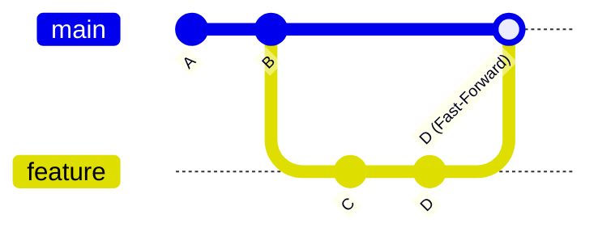
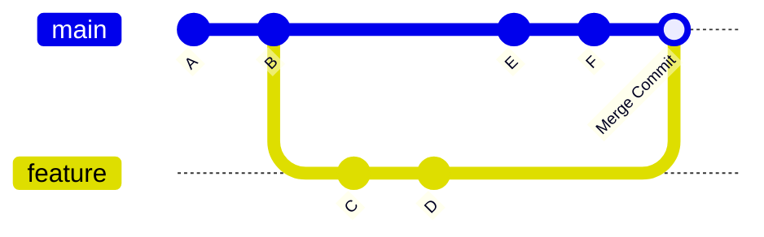
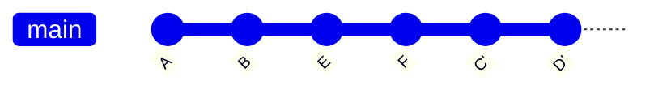
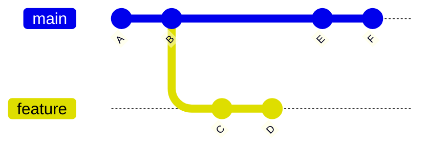
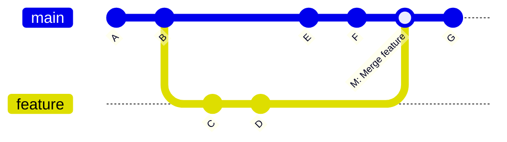
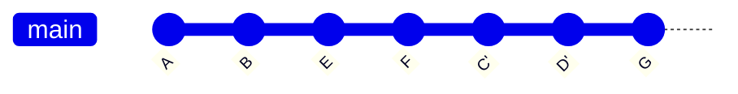
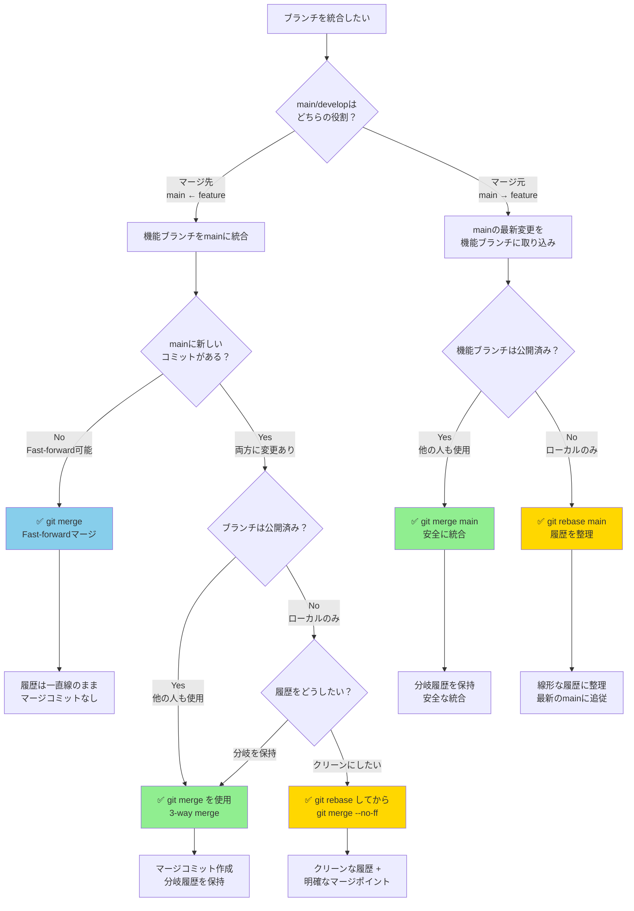
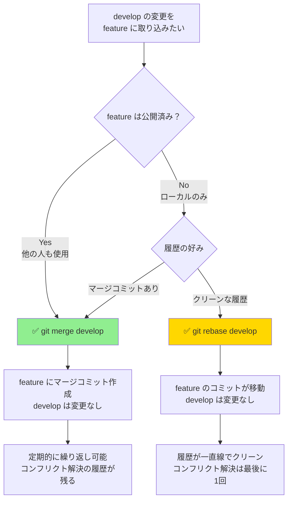
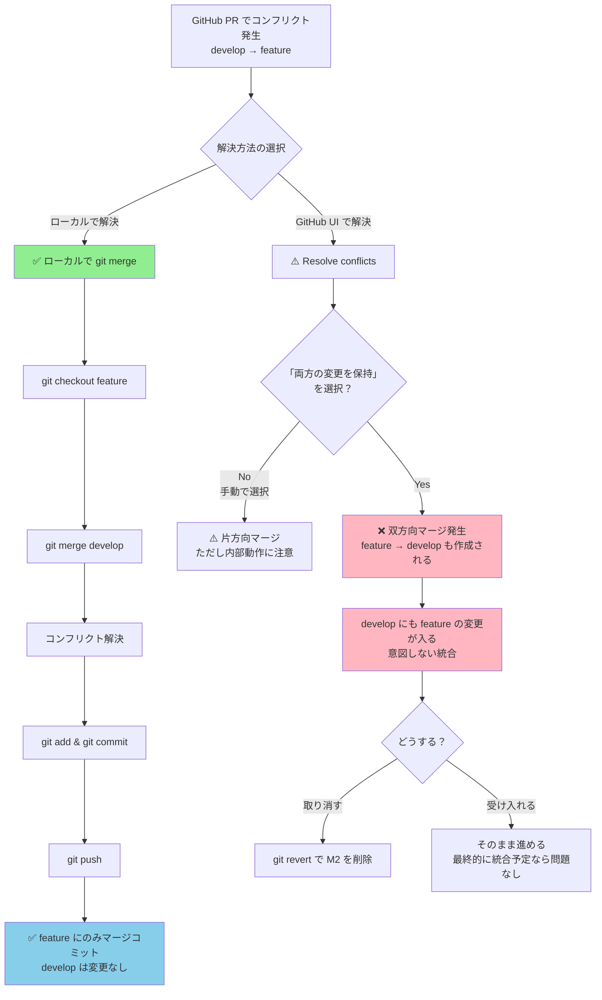

# 03. Merge と Rebase の違い - 統合の2つのアプローチ

Git でブランチを統合する際の2つの主要な方法、`git merge` と `git rebase` の違いについて詳しく説明します。どちらも「統合」を行いますが、履歴の扱い方が根本的に異なります。

## 📋 目次

- [merge と rebase の基本概念](#merge-と-rebase-の基本概念)
- [git merge - ブランチの統合（履歴保持）](#git-merge---ブランチの統合履歴保持)
- [git rebase - コミット履歴の再構築](#git-rebase---コミット履歴の再構築)
- [動作の違いを Mermaid で比較](#動作の違いを-mermaid-で比較)
- [実践例での違いの確認](#実践例での違いの確認)
- [使い分けのガイドライン](#使い分けのガイドライン)

---

## merge と rebase の基本概念

### 🔄 git merge の特徴
**履歴を保持した統合** - ブランチの分岐・統合の履歴をそのまま残す

### 📝 git rebase の特徴  
**履歴を線形に再構築** - コミット履歴を一直線に書き換えて統合

### 🎯 根本的な違い

| 観点 | git merge | git rebase |
|-----|-----------|------------|
| **履歴の形** | 分岐を保持（ダイアモンド型） | 線形（一直線） |
| **元の履歴** | 完全に保持 | 書き換える |
| **新しいコミット** | マージコミット作成 | 既存コミットを移動・再作成 |
| **可読性** | 分岐が見える | スッキリとした一本道 |
| **安全性** | 安全（履歴改変なし） | 注意が必要（履歴改変あり） |
| **適用場面** | チーム開発・公開履歴 | ローカル開発・履歴整理 |

---

## git merge - ブランチの統合（履歴保持）

### 📖 概要
ブランチの分岐・統合の履歴をそのまま保持しながら、2つのブランチを統合します。

### 💡 基本的な使い方

```bash
# 基本的なマージ
git checkout main
git merge feature-branch

# Fast-forwardを無効化（常にマージコミットを作成）
git merge --no-ff feature-branch

# コンフリクト発生時の操作
git merge feature-branch
# コンフリクト解決後
git add .
git commit  # または git merge --continue

# マージの中止
git merge --abort
```

### 🌳 merge の動作パターン

#### Fast-Forward Merge（早送りマージ）


#### 3-way Merge（三方向マージ）


### ✅ merge の利点

1. **履歴の完全保持**: すべての開発履歴が残る
2. **安全性**: 既存のコミットを変更しない
3. **分岐の可視化**: どこで何が統合されたかが明確
4. **取り消し可能**: マージコミットを revert すれば完全に取り消せる

### ❌ merge の欠点

1. **履歴の複雑化**: 分岐が多いと見づらくなる
2. **「雑音」の多い履歴**: すべてのマージが履歴に残る

---

## git rebase - コミット履歴の再構築

### 📖 概要
ブランチのコミットを別のブランチの最新コミットの後に「移植」して、履歴を一直線に再構築します。

### 💡 基本的な使い方

```bash
# 基本的なリベース
git checkout feature-branch
git rebase main

# または
git rebase main feature-branch

# インタラクティブリベース（履歴の編集）
git rebase -i HEAD~3

# コンフリクト発生時の操作
git rebase main
# コンフリクト解決後
git add .
git rebase --continue

# リベースの中止
git rebase --abort

# リベースのスキップ
git rebase --skip
```

### 🔄 rebase の動作パターン

#### 基本的なリベース


リベース前後の変化：
```bash
# リベース前
A---B---E---F (main)
     \
      C---D (feature)

# リベース後
A---B---E---F---C'---D' (main)
                    (feature)
```

#### インタラクティブリベース（履歴の編集）
```bash
# git rebase -i HEAD~3 の実行例

pick a1b2c3d Add user login
pick d4e5f6g Fix validation bug
pick g7h8i9j Add password reset

# 以下のような操作が可能：
# pick    : そのまま使用
# reword  : コミットメッセージを編集
# edit    : コミットを編集
# squash  : 前のコミットと統合
# fixup   : 前のコミットと統合（メッセージは破棄）
# drop    : コミットを削除
```

### ✅ rebase の利点

1. **クリーンな履歴**: 一直線で読みやすい履歴
2. **論理的な順序**: 機能ごとに整理された履歴
3. **履歴の編集**: 不要なコミットの統合・削除が可能
4. **Fast-forwardマージ**: マージ時にコンフリクトが起きにくい

### ❌ rebase の欠点

1. **履歴の改変**: 元の開発履歴が失われる
2. **危険性**: 既に公開されたコミットをリベースすると問題が起こる
3. **複雑性**: コンフリクト解決が複数回必要な場合がある
4. **学習コスト**: 理解と操作が merge より難しい

---

## 動作の違いを Mermaid で比較

### 🔄 同じ状況での merge vs rebase

#### 初期状態


#### merge を選択した場合


**結果**: 分岐・統合の履歴が保持される

#### rebase を選択した場合


**結果**: 一直線の履歴に再構築される

### 📊 選択フロー



#### フロー図の説明

**パターン1: main ← feature（機能ブランチをmainに統合）**

1. **mainに新しいコミットがない場合（Fast-forward可能）**
   - mainブランチが feature より古い状態
   - `git merge` で Fast-forward マージが自動的に実行される
   - マージコミットは作成されず、履歴は一直線のまま

   ```bash
   # 初期状態
   A---B (main)
        \
         C---D (feature)
   
   # git merge feature 実行後
   A---B---C---D (main, feature)
   ```

2. **mainに新しいコミットがある場合（両方に変更あり）**
   - mainと feature の両方に独自のコミットがある
   - **公開済みブランチ**: `git merge` で 3-way merge
   - **ローカルブランチ**: 
     - 分岐を保持 → `git merge`
     - クリーンにしたい → `git rebase` してから `git merge --no-ff`（推奨）

   ```bash
   # 初期状態
   A---B---E---F (main)
        \
         C---D (feature)
   ```

**パターン2: main → feature（mainの変更を機能ブランチに取り込み）**

- **公開済みブランチ**: `git merge main` を使用（安全）
  - 分岐履歴が保持される
  - 他の開発者への影響なし
  
- **ローカルブランチ**: `git rebase main` を使用（クリーン）
  - 履歴が線形に整理される
  - mainの最新状態に追従

#### 具体例とコマンド

**ケース1: Fast-forward マージ（mainに変更なし）**
```bash
# 状況確認
git checkout main
git log --oneline --graph --all
# main が feature より古い場合

# マージ実行（自動的に Fast-forward）
git merge feature-branch
# Updating a1b2c3d..d4e5f6g
# Fast-forward

# 結果: マージコミットなし、履歴は一直線
```

**ケース2: 3-way マージ（両方に変更あり、公開済み）**
```bash
# 状況: main と feature の両方に新しいコミット
# main: A-B-E-F
# feature: A-B-C-D

git checkout main
git merge feature-branch
# Merge made by the 'ort' strategy.
# マージコミットが自動作成される

# 結果: 分岐・統合の履歴が保持される
```

**ケース3: rebase + merge（両方に変更あり、ローカル）**
```bash
# 推奨パターン: クリーンな履歴 + 明確なマージポイント

# 1. feature ブランチで履歴を整理
git checkout feature-branch
git rebase main
# feature のコミットが main の最新に移動

# 2. main に戻って明示的にマージ
git checkout main
git merge --no-ff feature-branch
# --no-ff で Fast-forward を無効化し、マージコミットを作成

# 結果: 
# - feature ブランチ内は一直線
# - マージポイントが明確
# - 機能単位での取り消しが可能
```

**ケース4: mainの変更を取り込む（公開済みブランチ）**
```bash
# 公開済みの機能ブランチに main の変更を取り込む
git checkout feature-branch
git merge main
# マージコミットが作成される

# 結果: 安全だが分岐が複雑になる
```

**ケース5: mainの変更を取り込む（ローカルブランチ）**
```bash
# ローカルの機能ブランチに main の変更を取り込む
git checkout feature-branch
git rebase main
# コミットが main の最新に移動

# 結果: 履歴が一直線でクリーン
```

#### ⚠️ Fast-forward を強制的に無効化する理由

```bash
# Fast-forward 可能な場合でも --no-ff を使用する理由

# Fast-forward マージ（デフォルト）
git merge feature
# 結果: A---B---C---D (main)
# 問題: どこからどこまでが feature の作業かわからない

# --no-ff でマージコミットを作成
git merge --no-ff feature
# 結果: A---B-------M (main)
#            \     /
#             C---D (feature)
# 利点: 
# - feature の範囲が明確
# - git revert M で機能全体を取り消せる
# - 機能単位での履歴管理が可能
```

---

## 実践例での違いの確認

### 🧪 実験環境のセットアップ

```bash
# 練習用リポジトリの作成
mkdir merge-rebase-demo
cd merge-rebase-demo
git init

# 初期の履歴作成
echo "# Project" > README.md && git add . && git commit -m "A: Initial commit"
echo "## Features" >> README.md && git add . && git commit -m "B: Add features section"
```

### 🔄 merge の実験

```bash
# 機能ブランチでの作業
git checkout -b feature-docs
echo "### Authentication" >> README.md && git add . && git commit -m "C: Add auth docs"
echo "### Database" >> README.md && git add . && git commit -m "D: Add DB docs"

# mainブランチでの並行作業
git checkout main
echo "## Installation" >> README.md && git add . && git commit -m "E: Add installation"
echo "## Usage" >> README.md && git add . && git commit -m "F: Add usage"

# merge による統合
git merge feature-docs

# 履歴確認
git log --oneline --graph
```

**期待される結果（merge）**:
```
*   12ab34c (HEAD -> main) Merge branch 'feature-docs'
|\
| * 56cd78e (feature-docs) D: Add DB docs
| * 90ef12a C: Add auth docs
* | 34gh56b F: Add usage
* | 78ij90k E: Add installation
|/
* bc23de4 B: Add features section
* fg45hi6 A: Initial commit
```

### 📝 rebase の実験

```bash
# 新しい実験環境
git checkout -b feature-api
echo "### API Reference" >> README.md && git add . && git commit -m "G: Add API docs"
echo "### Examples" >> README.md && git add . && git commit -m "H: Add examples"

# mainブランチでの追加作業
git checkout main
echo "## Configuration" >> README.md && git add . && git commit -m "I: Add config"

# rebase による統合
git checkout feature-api
git rebase main

# mainブランチに統合
git checkout main
git merge feature-api  # Fast-forward merge

# 履歴確認
git log --oneline --graph
```

**期待される結果（rebase）**:
```
* 23wx45y (HEAD -> main, feature-api) H: Add examples
* 67za89b G: Add API docs
* 01cd23e I: Add config
*   12ab34c Merge branch 'feature-docs'
|\
| * 56cd78e D: Add DB docs
| * 90ef12a C: Add auth docs
* | 34gh56b F: Add usage
* | 78ij90k E: Add installation
|/
* bc23de4 B: Add features section
* fg45hi6 A: Initial commit
```

---

## 使い分けのガイドライン

### ✅ git merge を使うべき場面

```bash
# ✅ チーム開発での機能統合
git checkout main
git merge feature-team-work

# ✅ 公開済みブランチの統合
git checkout main
git merge release-v1.2

# ✅ 重要なマイルストーンの記録
git merge --no-ff feature-major-update
```

**適用場面:**
- チーム開発（他の開発者も関わるブランチ）
- 公開済みのブランチ
- 分岐・統合の履歴を残したい場合
- 安全性を最重視する場合

### ✅ git rebase を使うべき場面

```bash
# ✅ ローカルでの履歴整理
git rebase -i HEAD~5

# ✅ 機能ブランチの最新化
git checkout feature-branch
git rebase main

# ✅ プルリクエスト前の履歴クリーンアップ
git rebase -i origin/main
```

**適用場面:**
- 個人のローカル開発
- 未公開のブランチ
- 履歴をクリーンにしたい場合
- プルリクエスト前の準備

### ⚠️ 危険な rebase パターン

```bash
# ❌ 危険：公開済みブランチのリベース
git checkout main
git rebase feature-branch  # 他の人が使っているmainを書き換え

# ❌ 危険：他の人がチェックアウトしているブランチのリベース
git checkout shared-feature
git rebase main  # 他の開発者が混乱する

# ✅ 安全な代替案
git checkout main
git merge shared-feature
```

#### なぜこれらが危険なのか？

**ケース1: 公開済みの main ブランチをリベースする**
```bash
# 危険な操作
git checkout main
git rebase feature-branch
```

**問題点:**
1. **他の開発者が main をベースに作業している**
   - 他の開発者は古い main のコミット（例: A, B, C）をベースに作業中
   - リベースすると main のコミットが書き換えられる（A', B', C' になる）
   - 他の開発者の履歴と main の履歴が分岐してしまう

2. **コミットハッシュが変わる**
   ```bash
   # リベース前（他の開発者が見ている main）
   A---B---C (main)
   
   # リベース後（あなたの main）
   A'---B'---C' (main)
   
   # 他の開発者が git pull すると
   # コンフリクトや「diverged」エラーが発生
   ```

3. **強制プッシュが必要になる**
   ```bash
   git push --force  # 危険！他の開発者の作業を破壊する可能性
   ```

**ケース2: 共有されている feature ブランチをリベースする**
```bash
# 危険な操作
git checkout shared-feature
git rebase main
```

**問題点:**
1. **他の開発者も同じブランチで作業している**
   ```bash
   # Aさんの shared-feature
   A---B---C---D (shared-feature)
   
   # あなたがリベースした後
   A---B---E---F---C'---D' (shared-feature)
   
   # Bさんが git pull すると混乱
   # Bさんのローカルは古い C, D を持っている
   # リモートには新しい C', D' がある
   ```

2. **コミットが重複する可能性**
   - 他の開発者が古いコミット（C, D）をベースに作業を続ける
   - あなたの新しいコミット（C', D'）と内容は同じだが、ハッシュが異なる
   - マージ時に同じ変更が2回適用され、コンフリクトが発生

3. **他の開発者が強制的に対応する必要がある**
   ```bash
   # 他の開発者が取る必要のある対応
   git fetch
   git reset --hard origin/shared-feature  # ローカルの作業が失われる
   # または
   git pull --rebase  # コンフリクト解決が必要
   ```

#### 具体的な被害シナリオ

**シナリオ: 3人のチームで開発中**

1. **初期状態**
   ```
   A---B---C (main)
            \
             D---E (feature-alice, Aliceの作業)
   ```

2. **Bob が main で作業を開始**
   ```
   A---B---C (main, Bobのローカル)
            \
             D---E (feature-alice)
   ```

3. **Alice が main を rebase してしまう（危険な操作）**
   ```bash
   git checkout main
   git rebase feature-alice
   git push --force
   ```
   
   結果:
   ```
   A---B---C---D'---E' (main, Aliceのリモート)
   
   # Bob のローカルは古いまま
   A---B---C (main, Bobのローカル)
            \
             F---G (Bobの新しい作業)
   ```

4. **Bob が git pull すると**
   ```bash
   git pull
   # fatal: refusing to merge unrelated histories
   # または大量のコンフリクト
   ```

5. **Charlie も混乱**
   ```bash
   # Charlie の feature ブランチ
   A---B---C (main, ベース)
            \
             H---I (feature-charlie)
   
   # git pull origin main すると
   # C と D'---E' の間でコンフリクト
   ```

#### 安全な代替手段

**main に統合する場合:**
```bash
# ✅ 安全: merge を使用
git checkout main
git merge feature-branch
# または
git merge --no-ff feature-branch
```

**共有ブランチに main の変更を取り込む場合:**
```bash
# ✅ 安全: merge を使用
git checkout shared-feature
git merge main
```

**どうしても rebase したい場合:**
```bash
# 1. チーム全員に事前通知
# 2. 全員の作業が完了していることを確認
# 3. rebase を実行
git checkout shared-feature
git rebase main

# 4. チーム全員に連絡し、以下の操作を依頼
# 各メンバー:
git fetch
git checkout shared-feature
git reset --hard origin/shared-feature
```

###  ハイブリッドアプローチ

```bash
# 推奨パターン：rebase + merge
git checkout feature-branch
git rebase main              # まず履歴を整理
git checkout main
git merge --no-ff feature-branch  # 明示的なマージコミットで統合

# これにより得られる利点：
# 1. 機能ブランチ内はクリーンな履歴
# 2. マージポイントが明確
# 3. 機能単位での取り消しが可能
```

## 🎯 マージの方向性とマージコミットの作成場所

### ⚠️ よくある誤解

**誤解**: `git checkout feature` → `git merge develop` すると、feature と develop の両方にマージコミットが作成される

**真実**: マージコミットは**現在チェックアウトしているブランチにのみ**作成されます

### 📖 マージの仕組み

```bash
# ケース1: develop の変更を feature に取り込む
git checkout feature
git merge develop

# 結果: マージコミットは feature ブランチにのみ作成される
# develop ブランチは何も変わらない（1ミリも変わらない）
```

#### 具体例で確認

**初期状態:**
```
A---B---C---D (develop)
     \
      E---F (feature)
```

**操作: feature で develop をマージ**
```bash
git checkout feature
git merge develop
```

**結果:**
```
A---B---C---D (develop) ← developは変わらない
     \       \
      E---F---M (feature) ← マージコミットMはfeatureに作成
```

**develop ブランチの状態:**
- コミット履歴: A → B → C → D（変化なし）
- HEAD の位置: D（変化なし）
- 影響: **完全にゼロ**

**feature ブランチの状態:**
- コミット履歴: A → B → E → F → M（マージコミットMが追加）
- M は2つの親を持つ: F（feature側）と D（develop側）
- HEAD の位置: M

### 🔍 「両方に影響がある」と感じる理由

実際には以下のような状況で誤解が生じます:

**シナリオ1: 双方向マージ（アンチパターン）**
```bash
# 1. develop の変更を feature に取り込む
git checkout feature
git merge develop
# feature にマージコミット M1 が作成

# 2. その後、feature を develop にマージ
git checkout develop
git merge feature
# develop にマージコミット M2 が作成

# 結果: 両方にマージコミットがあるように見える
# しかし、これは2回の独立したマージ操作
```

**結果の履歴:**
```
A---B---C---D-------M2 (develop)
     \       \     /
      E---F---M1 (feature)
```

- M1: feature へのマージコミット（develop → feature）
- M2: develop へのマージコミット（feature → develop）

**シナリオ2: コンフリクト解決時の混乱**
```bash
git checkout feature
git merge develop
# CONFLICT (content): Merge conflict in file.txt

# コンフリクト解決
git add file.txt
git commit
# マージコミットが feature に作成される

# この時点で develop は何も変わっていない
git checkout develop
git log --oneline -5
# コンフリクトがあってもなくても、develop は無関係
```

### ✅ 正しい運用パターン

#### パターン1: 一方向のマージ（推奨）

**develop の最新を feature に取り込む（定期的）**
```bash
# feature ブランチで作業中、develop の最新変更を取り込みたい
git checkout feature
git merge develop

# 結果:
# - develop は変更なし
# - feature にマージコミットが追加
# - feature は develop の最新状態を含む
```

**feature を develop に統合する（作業完了時）**
```bash
# feature の開発が完了し、develop に統合する
git checkout develop
git merge feature

# 結果:
# - feature は変更なし
# - develop にマージコミット（または Fast-forward）
# - develop が feature の変更を含む
```

#### パターン2: rebase を使う（ローカルブランチのみ）

**feature が未公開の場合、rebase を使ってクリーンに保つ**
```bash
# develop の最新を feature に取り込む（マージコミットなし）
git checkout feature
git rebase develop

# 結果:
# - develop は変更なし
# - feature のコミットが develop の最新に移動
# - マージコミットは作成されない

# feature を develop に統合
git checkout develop
git merge feature  # Fast-forward マージになる

# 最終的な履歴:
A---B---C---D---E'---F' (develop, feature)
# クリーンな一直線の履歴
```

### 📊 ケース別の選択フロー



### 🔧 実践例: 継続的な統合

**状況: feature ブランチで長期開発中、develop が頻繁に更新される**

```bash
# 初期状態
A---B---C (develop)
     \
      D---E (feature, 自分の作業)

# develop が更新された（他の人の作業）
A---B---C---F---G (develop)
     \
      D---E (feature)

# feature に develop の変更を取り込む（1回目）
git checkout feature
git merge develop

# 結果:
A---B---C---F---G (develop) ← 変更なし
     \           \
      D---E-------M1 (feature) ← M1 が追加

# さらに作業を続ける
A---B---C---F---G (develop)
     \           \
      D---E-------M1---H---I (feature)

# develop がまた更新された
A---B---C---F---G---J---K (develop)
     \           \
      D---E-------M1---H---I (feature)

# feature に develop の変更を取り込む（2回目）
git checkout feature
git merge develop

# 結果:
A---B---C---F---G---J---K (develop) ← 変更なし
     \           \       \
      D---E-------M1---H---I---M2 (feature) ← M2 が追加

# 最終的に feature を develop に統合
git checkout develop
git merge feature

# 最終結果:
A---B---C---F---G---J---K-----------M3 (develop)
     \           \       \         /
      D---E-------M1---H---I---M2 (feature)
```

**この履歴の読み方:**
- M1, M2: develop の変更を取り込んだマージコミット（feature ブランチ内）
- M3: feature を develop に統合したマージコミット（develop ブランチ）
- develop には M3 だけが追加された（M1, M2 は develop には存在しない）

### 💡 まとめ: マージの真実

| 操作 | 影響を受けるブランチ | 影響を受けないブランチ |
|-----|-------------------|---------------------|
| `git checkout feature`<br/>`git merge develop` | feature<br/>（マージコミット追加） | develop<br/>（完全に変化なし） |
| `git checkout develop`<br/>`git merge feature` | develop<br/>（マージコミット追加） | feature<br/>（完全に変化なし） |

**重要なポイント:**
1. マージは一方向の操作
2. マージコミットは現在のブランチにのみ作成
3. マージ元（される側）のブランチは何も変わらない
4. 「両方に影響」は2回のマージ操作の結果（双方向マージ）

### 🔍 GitHub プルリクエストでのコンフリクト解決の特殊なケース

#### ⚠️ GitHub PR でのコンフリクト解決時の挙動

GitHub のプルリクエストでコンフリクトを解決する際、**意図しない双方向マージが発生する**ことがあります。

**シナリオ: develop → feature にマージしたい（PR: feature ← develop）**

```bash
# 初期状態
A---B---C---D (develop)
     \
      E---F---G (feature)

# 目的: develop の最新 (D) を feature に取り込みたい
# GitHub で PR を作成: develop → feature
```

**GitHub UI でコンフリクト解決すると:**

1. **GitHub がコンフリクト解決用の一時的なマージを作成**
   ```
   A---B---C---D (develop)
        \       \
         E---F---G---M1 (feature)
   ```
   - M1: `Merge branch 'develop' into feature` (意図通り)

2. **しかし、GitHub のコンフリクト解決 UI は内部的に逆方向のマージを使用する場合がある**
   ```
   # GitHub が内部的に作成するコミット
   "Merge branch 'feature' into develop"
   ```
   
   これは GitHub のコンフリクト解決プロセスの仕様によるもの:
   - GitHub は一時的に両方のブランチの内容をマージして解決案を提示
   - 「両方の変更を保持」を選択すると、feature 側の変更も develop に反映される形でマージコミットが作られる
   - その結果、**意図しない逆方向のマージコミット**が作成される

**実際の履歴:**
```
A---B---C---D-------M2 (develop)
     \       \     /
      E---F---G---M1 (feature)
```

- M1: `Merge pull request from develop` (意図通り: develop → feature)
- M2: `Merge branch 'feature' into develop` (意図しない: feature → develop)

#### 🎯 なぜこうなるのか？

**GitHub のコンフリクト解決の内部動作:**

1. **「両方の変更を保持」は双方向マージを意味する**
   ```
   # あなたの意図
   develop の変更を feature に取り込みたい
   
   # GitHub の解釈
   develop の変更を feature に + feature の変更を develop に
   ```

2. **PR の方向とマージの方向が混在**
   - PR は `develop → feature` を表現
   - しかしコンフリクト解決時に feature の変更も develop に反映される
   - 結果的に双方向のマージが発生

3. **「両方の変更を保持」の実際の意味**
   ```bash
   # ローカルでの操作に置き換えると
   git checkout feature
   git merge develop  # M1: develop → feature
   
   git checkout develop
   git merge feature  # M2: feature → develop (意図しない)
   ```

#### ✅ 正しい対処法

**方法1: ローカルでコンフリクトを解決する（推奨）**

```bash
# 1. feature ブランチで develop をマージ
git checkout feature
git merge develop

# 2. コンフリクトを解決
# ファイルを編集して両方の変更を手動で統合

# 3. 解決したファイルをステージング
git add .

# 4. マージコミットを作成
git commit
# デフォルトメッセージ: "Merge branch 'develop' into feature"

# 5. プッシュ
git push origin feature

# 結果: feature にのみマージコミットが作成される
# develop は変更なし
```

**方法2: GitHub で正しくコンフリクト解決する**

```bash
# GitHub UI でのコンフリクト解決の注意点:

# ❌ 避けるべき操作
# - 「Resolve conflicts」ボタンで「両方の変更を保持」を選択
#   → 双方向マージが発生する可能性

# ✅ 推奨される操作
# 1. PR のコンフリクトを確認
# 2. ローカルで git merge してコンフリクト解決
# 3. 解決後に push すると PR が自動更新される
```

**方法3: 既に双方向マージが発生した場合の対処**

```bash
# 状況: develop に意図しないマージコミット M2 が作成された

# オプション1: revert で M2 を取り消す（推奨）
git checkout develop
git revert -m 1 HEAD  # M2 を取り消す
# -m 1: 最初の親（develop側）を優先

git push origin develop

# オプション2: reset で M2 を削除（develop が公開済みの場合は危険）
git checkout develop
git reset --hard HEAD~1  # M2 を削除
git push --force origin develop  # 危険！チームに影響

# オプション3: そのまま受け入れる
# - feature の変更が develop に入っても問題ない場合
# - 最終的に feature を develop にマージする予定だった場合
```

#### 📊 GitHub PR でのコンフリクト解決フロー



#### 💡 GitHub UI での「両方の変更を保持」の真実

**表示されるメッセージ:**
```
Keep both changes
両方の変更を保持する
```

**実際の動作:**
```bash
# あなたの期待
develop の変更を feature に統合
feature は両方の内容を持つ

# GitHub の実際の動作（場合による）
develop の変更を feature に統合 + feature の変更を develop に統合
→ 双方向マージ
```

**なぜこうなるのか:**
1. GitHub はコンフリクト解決のために一時的なマージブランチを作成
2. 「両方の変更を保持」は両方のブランチに変更を反映する操作
3. PR の方向に関わらず、双方向の統合が発生する可能性がある

#### 🎯 推奨されるワークフロー

**develop の最新を feature に取り込む正しい方法:**

```bash
# ===== ローカルで操作（最も安全）=====

# 1. 最新の develop を取得
git checkout develop
git pull origin develop

# 2. feature ブランチに切り替え
git checkout feature
git pull origin feature

# 3. develop をマージ
git merge develop
# コンフリクトが発生

# 4. コンフリクトを解決
# VSCode や Git GUI でファイルを編集
# 両方の変更を手動で統合

# 5. 解決したファイルをステージング
git add .

# 6. マージコミットを作成
git commit
# デフォルトメッセージ:
# "Merge branch 'develop' into feature"

# 7. プッシュ
git push origin feature

# ===== 結果 =====
# ✅ feature にのみマージコミット M1 が作成
# ✅ develop は何も変わらない
# ✅ GitHub の PR が自動的に更新される
```

**最終的な履歴:**
```
A---B---C---D (develop) ← 変更なし
     \       \
      E---F---G---M1 (feature) ← M1 のみ追加
      
M1: "Merge branch 'develop' into feature"
```

#### 🔧 実際のコマンド例と出力

```bash
# 初期状態の確認
$ git log --oneline --graph --all
* d4e5f6g (origin/develop, develop) Update config
| * g7h8i9j (HEAD -> feature, origin/feature) Add new feature
| * a1b2c3d Fix bug
|/
* bc23de4 Common ancestor

# develop を feature にマージ
$ git checkout feature
$ git merge develop
Auto-merging config.json
CONFLICT (content): Merge conflict in config.json
Automatic merge failed; fix conflicts and then commit the result.

# コンフリクトを解決（VSCode で編集）
$ git status
On branch feature
You have unmerged paths.
  (fix conflicts and run "git commit")

Unmerged paths:
  (use "git add <file>..." to mark resolution)
        both modified:   config.json

# 解決後
$ git add config.json
$ git commit
[feature j9k0l1m] Merge branch 'develop' into feature

# プッシュ
$ git push origin feature

# 最終的な履歴
$ git log --oneline --graph --all
*   j9k0l1m (HEAD -> feature, origin/feature) Merge branch 'develop' into feature
|\
| * d4e5f6g (origin/develop, develop) Update config
* | g7h8i9j Add new feature
* | a1b2c3d Fix bug
|/
* bc23de4 Common ancestor

# develop は変更なし
$ git checkout develop
$ git log --oneline -3
d4e5f6g (HEAD -> develop, origin/develop) Update config
bc23de4 Common ancestor
...
```

---

**ご質問への回答:**
> develop → feature にマージしたかっただけなのに feature → develop のマージも形成されてしまう

これは **GitHub のプルリクエスト UI でコンフリクト解決する際の特殊な挙動**です:

1. **「両方の変更を保持」を選択すると双方向マージが発生する**
   - `Merge branch 'develop' into feature` (意図通り)
   - `Merge branch 'feature' into develop` (意図しない)

2. **解決策: ローカルでコンフリクト解決する**
   ```bash
   git checkout feature
   git merge develop
   # コンフリクト解決
   git add . && git commit && git push
   ```
   
   この方法なら feature にのみマージコミットが作成され、develop は変更されません。

3. **既に双方向マージが発生した場合**
   - `git revert` で意図しないマージを取り消す
   - または、最終的に feature を develop にマージする予定なら受け入れる

---

## 🚨 よくあるトラブルと解決法

### rebase 中のコンフリクト解決

```bash
# コンフリクト発生時
git rebase main
# Auto-merging file.txt
# CONFLICT (content): Merge conflict in file.txt

# 1. コンフリクトを解決
# file.txt を編集

# 2. ステージングに追加
git add file.txt

# 3. リベースを継続
git rebase --continue

# または中止
git rebase --abort
```

### 間違ったリベースの修正

```bash
# リベース前の状態に戻す
git reflog
git reset --hard HEAD@{2}  # リベース前の状態
```

## 📚 次のステップ

merge と rebase の違いを理解したら、次は [04. Reset と Revert の違い](04-reset-vs-revert.md) に進んで、取り消し操作の違いについて学びましょう。