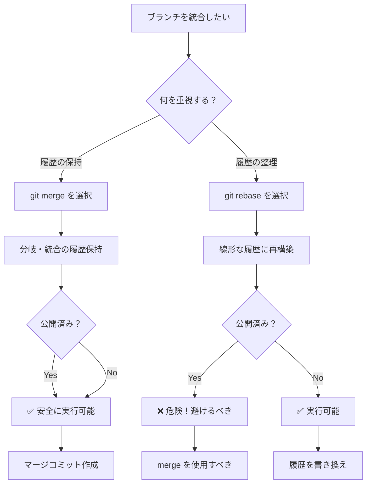
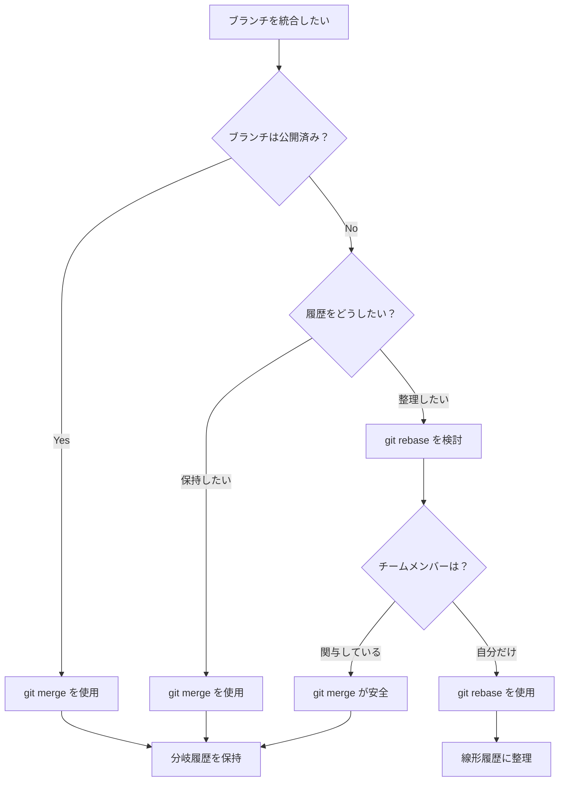

# 03. Merge と Rebase の違い - 統合の2つのアプローチ

Git でブランチを統合する際の2つの主要な方法、`git merge` と `git rebase` の違いについて詳しく説明します。どちらも「統合」を行いますが、履歴の扱い方が根本的に異なります。

## 📋 目次

- [merge と rebase の基本概念](#merge-と-rebase-の基本概念)
- [git merge - ブランチの統合（履歴保持）](#git-merge---ブランチの統合履歴保持)
- [git rebase - コミット履歴の再構築](#git-rebase---コミット履歴の再構築)
- [動作の違いを Mermaid で比較](#動作の違いを-mermaid-で比較)
- [実践例での違いの確認](#実践例での違いの確認)
- [使い分けのガイドライン](#使い分けのガイドライン)

---

## merge と rebase の基本概念

### 🔄 git merge の特徴
**履歴を保持した統合** - ブランチの分岐・統合の履歴をそのまま残す

### 📝 git rebase の特徴  
**履歴を線形に再構築** - コミット履歴を一直線に書き換えて統合

### 🎯 根本的な違い

| 観点 | git merge | git rebase |
|-----|-----------|------------|
| **履歴の形** | 分岐を保持（ダイアモンド型） | 線形（一直線） |
| **元の履歴** | 完全に保持 | 書き換える |
| **新しいコミット** | マージコミット作成 | 既存コミットを移動・再作成 |
| **可読性** | 分岐が見える | スッキリとした一本道 |
| **安全性** | 安全（履歴改変なし） | 注意が必要（履歴改変あり） |
| **適用場面** | チーム開発・公開履歴 | ローカル開発・履歴整理 |

---

## git merge - ブランチの統合（履歴保持）

### 📖 概要
ブランチの分岐・統合の履歴をそのまま保持しながら、2つのブランチを統合します。

### 💡 基本的な使い方

```bash
# 基本的なマージ
git checkout main
git merge feature-branch

# Fast-forwardを無効化（常にマージコミットを作成）
git merge --no-ff feature-branch

# コンフリクト発生時の操作
git merge feature-branch
# コンフリクト解決後
git add .
git commit  # または git merge --continue

# マージの中止
git merge --abort
```

### 🌳 merge の動作パターン

#### Fast-Forward Merge（早送りマージ）
```mermaid
gitgraph
    commit id: "A"
    commit id: "B"
    branch feature
    checkout feature
    commit id: "C"
    commit id: "D"
    checkout main
    merge feature id: "D (Fast-Forward)"
```

#### 3-way Merge（三方向マージ）
```mermaid
gitgraph
    commit id: "A"
    commit id: "B"
    branch feature
    checkout feature
    commit id: "C"
    commit id: "D"
    checkout main
    commit id: "E"
    commit id: "F"
    merge feature id: "Merge Commit"
```

### ✅ merge の利点

1. **履歴の完全保持**: すべての開発履歴が残る
2. **安全性**: 既存のコミットを変更しない
3. **分岐の可視化**: どこで何が統合されたかが明確
4. **取り消し可能**: マージコミットを revert すれば完全に取り消せる

### ❌ merge の欠点

1. **履歴の複雑化**: 分岐が多いと見づらくなる
2. **「雑音」の多い履歴**: すべてのマージが履歴に残る

---

## git rebase - コミット履歴の再構築

### 📖 概要
ブランチのコミットを別のブランチの最新コミットの後に「移植」して、履歴を一直線に再構築します。

### 💡 基本的な使い方

```bash
# 基本的なリベース
git checkout feature-branch
git rebase main

# または
git rebase main feature-branch

# インタラクティブリベース（履歴の編集）
git rebase -i HEAD~3

# コンフリクト発生時の操作
git rebase main
# コンフリクト解決後
git add .
git rebase --continue

# リベースの中止
git rebase --abort

# リベースのスキップ
git rebase --skip
```

### 🔄 rebase の動作パターン

#### 基本的なリベース
```mermaid
gitgraph
    commit id: "A"
    commit id: "B"
    commit id: "E"
    commit id: "F"
    commit id: "C'"
    commit id: "D'"
```

リベース前後の変化：
```bash
# リベース前
A---B---E---F (main)
     \
      C---D (feature)

# リベース後
A---B---E---F---C'---D' (main)
                    (feature)
```

#### インタラクティブリベース（履歴の編集）
```bash
# git rebase -i HEAD~3 の実行例

pick a1b2c3d Add user login
pick d4e5f6g Fix validation bug
pick g7h8i9j Add password reset

# 以下のような操作が可能：
# pick    : そのまま使用
# reword  : コミットメッセージを編集
# edit    : コミットを編集
# squash  : 前のコミットと統合
# fixup   : 前のコミットと統合（メッセージは破棄）
# drop    : コミットを削除
```

### ✅ rebase の利点

1. **クリーンな履歴**: 一直線で読みやすい履歴
2. **論理的な順序**: 機能ごとに整理された履歴
3. **履歴の編集**: 不要なコミットの統合・削除が可能
4. **Fast-forwardマージ**: マージ時にコンフリクトが起きにくい

### ❌ rebase の欠点

1. **履歴の改変**: 元の開発履歴が失われる
2. **危険性**: 既に公開されたコミットをリベースすると問題が起こる
3. **複雑性**: コンフリクト解決が複数回必要な場合がある
4. **学習コスト**: 理解と操作が merge より難しい

---

## 動作の違いを Mermaid で比較

### 🔄 同じ状況での merge vs rebase

#### 初期状態
```mermaid
gitgraph
    commit id: "A"
    commit id: "B"
    branch feature
    checkout feature
    commit id: "C"
    commit id: "D"
    checkout main
    commit id: "E"
    commit id: "F"
```

#### merge を選択した場合
```mermaid
gitgraph
    commit id: "A"
    commit id: "B"
    branch feature
    checkout feature
    commit id: "C"
    commit id: "D"
    checkout main
    commit id: "E"
    commit id: "F"
    merge feature id: "M: Merge feature"
    commit id: "G"
```

**結果**: 分岐・統合の履歴が保持される

#### rebase を選択した場合
```mermaid
gitgraph
    commit id: "A"
    commit id: "B"
    commit id: "E"
    commit id: "F"
    commit id: "C'"
    commit id: "D'"
    commit id: "G"
```

**結果**: 一直線の履歴に再構築される

### 📊 選択フロー



---

## 実践例での違いの確認

### 🧪 実験環境のセットアップ

```bash
# 練習用リポジトリの作成
mkdir merge-rebase-demo
cd merge-rebase-demo
git init

# 初期の履歴作成
echo "# Project" > README.md && git add . && git commit -m "A: Initial commit"
echo "## Features" >> README.md && git add . && git commit -m "B: Add features section"
```

### 🔄 merge の実験

```bash
# 機能ブランチでの作業
git checkout -b feature-docs
echo "### Authentication" >> README.md && git add . && git commit -m "C: Add auth docs"
echo "### Database" >> README.md && git add . && git commit -m "D: Add DB docs"

# mainブランチでの並行作業
git checkout main
echo "## Installation" >> README.md && git add . && git commit -m "E: Add installation"
echo "## Usage" >> README.md && git add . && git commit -m "F: Add usage"

# merge による統合
git merge feature-docs

# 履歴確認
git log --oneline --graph
```

**期待される結果（merge）**:
```
*   12ab34c (HEAD -> main) Merge branch 'feature-docs'
|\
| * 56cd78e (feature-docs) D: Add DB docs
| * 90ef12a C: Add auth docs
* | 34gh56b F: Add usage
* | 78ij90k E: Add installation
|/
* bc23de4 B: Add features section
* fg45hi6 A: Initial commit
```

### 📝 rebase の実験

```bash
# 新しい実験環境
git checkout -b feature-api
echo "### API Reference" >> README.md && git add . && git commit -m "G: Add API docs"
echo "### Examples" >> README.md && git add . && git commit -m "H: Add examples"

# mainブランチでの追加作業
git checkout main
echo "## Configuration" >> README.md && git add . && git commit -m "I: Add config"

# rebase による統合
git checkout feature-api
git rebase main

# mainブランチに統合
git checkout main
git merge feature-api  # Fast-forward merge

# 履歴確認
git log --oneline --graph
```

**期待される結果（rebase）**:
```
* 23wx45y (HEAD -> main, feature-api) H: Add examples
* 67za89b G: Add API docs
* 01cd23e I: Add config
*   12ab34c Merge branch 'feature-docs'
|\
| * 56cd78e D: Add DB docs
| * 90ef12a C: Add auth docs
* | 34gh56b F: Add usage
* | 78ij90k E: Add installation
|/
* bc23de4 B: Add features section
* fg45hi6 A: Initial commit
```

---

## 使い分けのガイドライン

### ✅ git merge を使うべき場面

```bash
# ✅ チーム開発での機能統合
git checkout main
git merge feature-team-work

# ✅ 公開済みブランチの統合
git checkout main
git merge release-v1.2

# ✅ 重要なマイルストーンの記録
git merge --no-ff feature-major-update
```

**適用場面:**
- チーム開発（他の開発者も関わるブランチ）
- 公開済みのブランチ
- 分岐・統合の履歴を残したい場合
- 安全性を最重視する場合

### ✅ git rebase を使うべき場面

```bash
# ✅ ローカルでの履歴整理
git rebase -i HEAD~5

# ✅ 機能ブランチの最新化
git checkout feature-branch
git rebase main

# ✅ プルリクエスト前の履歴クリーンアップ
git rebase -i origin/main
```

**適用場面:**
- 個人のローカル開発
- 未公開のブランチ
- 履歴をクリーンにしたい場合
- プルリクエスト前の準備

### ⚠️ 危険な rebase パターン

```bash
# ❌ 危険：公開済みブランチのリベース
git checkout main
git rebase feature-branch  # 他の人が使っているmainを書き換え

# ❌ 危険：他の人がチェックアウトしているブランチのリベース
git checkout shared-feature
git rebase main  # 他の開発者が混乱する

# ✅ 安全な代替案
git checkout main
git merge shared-feature
```

### 📋 実践的な使い分けフロー



### 🔄 ハイブリッドアプローチ

```bash
# 推奨パターン：rebase + merge
git checkout feature-branch
git rebase main              # まず履歴を整理
git checkout main
git merge --no-ff feature-branch  # 明示的なマージコミットで統合

# これにより得られる利点：
# 1. 機能ブランチ内はクリーンな履歴
# 2. マージポイントが明確
# 3. 機能単位での取り消しが可能
```

## 🚨 よくあるトラブルと解決法

### rebase 中のコンフリクト解決

```bash
# コンフリクト発生時
git rebase main
# Auto-merging file.txt
# CONFLICT (content): Merge conflict in file.txt

# 1. コンフリクトを解決
# file.txt を編集

# 2. ステージングに追加
git add file.txt

# 3. リベースを継続
git rebase --continue

# または中止
git rebase --abort
```

### 間違ったリベースの修正

```bash
# リベース前の状態に戻す
git reflog
git reset --hard HEAD@{2}  # リベース前の状態
```

## 📚 次のステップ

merge と rebase の違いを理解したら、次は [04. Reset と Revert の違い](04-reset-vs-revert.md) に進んで、取り消し操作の違いについて学びましょう。