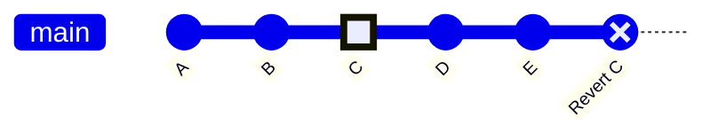
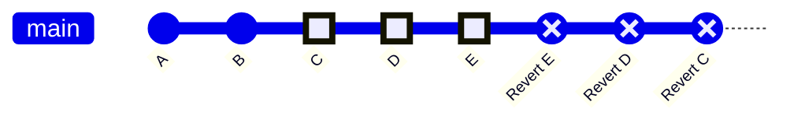
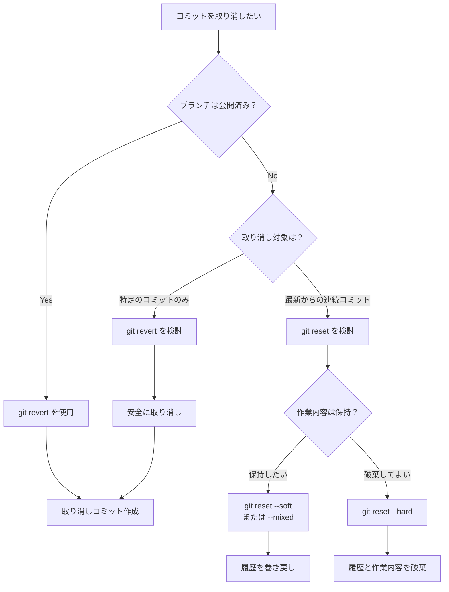
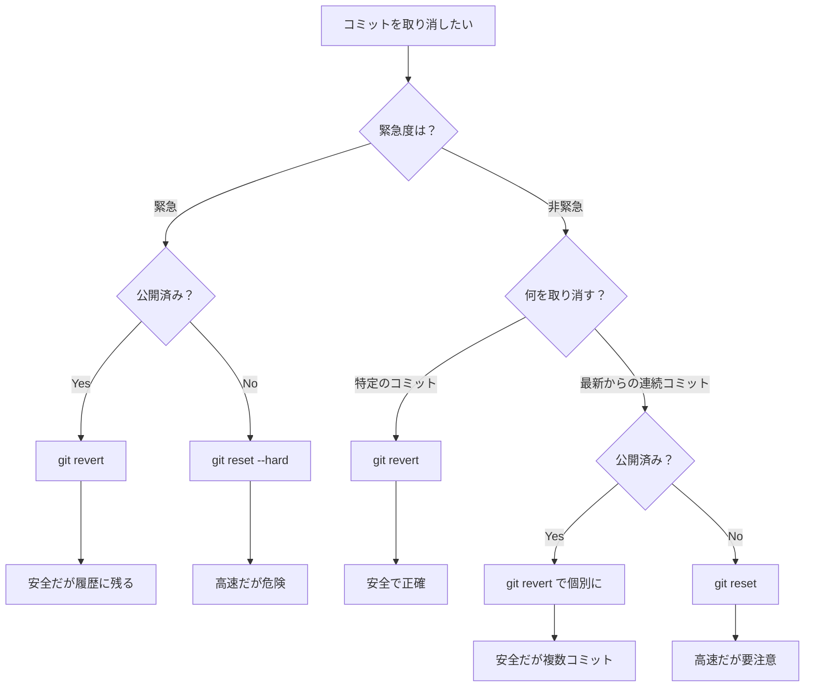

# 04. Reset と Revert の違い - 取り消しの2つのアプローチ

Git で変更を取り消す際の2つの主要な方法、`git reset` と `git revert` の違いについて詳しく説明します。どちらも「取り消し」を行いますが、履歴への影響が根本的に異なります。

## 📋 目次

- [reset と revert の基本概念](#reset-と-revert-の基本概念)
- [git reset - 履歴の巻き戻し](#git-reset---履歴の巻き戻し)
- [git revert - 取り消しコミットの作成](#git-revert---取り消しコミットの作成)
- [動作の違いを Mermaid で比較](#動作の違いを-mermaid-で比較)
- [実践例での違いの確認](#実践例での違いの確認)
- [使い分けのガイドライン](#使い分けのガイドライン)

---

## reset と revert の基本概念

### ⏪ git reset の特徴
**履歴の巻き戻し** - 指定したコミットまで履歴を巻き戻し、それ以降を削除

### ↩️ git revert の特徴  
**取り消しコミットの作成** - 指定したコミットの変更を打ち消す新しいコミットを作成

### 🎯 根本的な違い

| 観点 | git reset | git revert |
|-----|-----------|------------|
| **履歴への影響** | 履歴を削除・改変 | 履歴に追加 |
| **安全性** | 危険（履歴が失われる） | 安全（履歴は保持） |
| **公開済みブランチ** | ❌ 避けるべき | ✅ 安全に使用可能 |
| **対象** | 連続したコミット群 | 任意の単一コミット |
| **元に戻す方法** | reflog から復旧 | revert の revert |
| **適用場面** | ローカル開発 | チーム開発・本番環境 |

---

## git reset - 履歴の巻き戻し

### 📖 概要
HEAD、インデックス（ステージングエリア）、作業ディレクトリを指定したコミットの状態に戻します。

### 💡 reset の3つのモード

#### --soft : HEAD のみ移動
```bash
git reset --soft HEAD~1
```
- HEAD のみ指定コミットに移動
- ステージングエリアと作業ディレクトリは変更なし
- 取り消されたコミットの変更はステージング済み状態で残る

#### --mixed（デフォルト）: HEAD + インデックス
```bash
git reset HEAD~1
git reset --mixed HEAD~1  # 同じ
```
- HEAD とステージングエリアを指定コミットに戻す
- 作業ディレクトリは変更なし
- 取り消されたコミットの変更は未ステージング状態で残る

#### --hard : すべてリセット
```bash
git reset --hard HEAD~1
```
- HEAD、ステージングエリア、作業ディレクトリすべてを指定コミットに戻す
- **取り消されたコミットの変更は完全に削除される**
- ⚠️ **最も危険** - 作業内容が失われる可能性

### 🔄 reset の動作パターン


```bash
# reset 前
A---B---C---D---E (HEAD -> main)

# git reset --hard C 実行後
A---B---C (HEAD -> main)
# D, E のコミットは履歴から削除される
```

### 📝 reset の使用例

```bash
# 直前のコミットを取り消し（変更は保持）
git reset HEAD~1

# 直前のコミットを完全に取り消し
git reset --hard HEAD~1

# 特定のコミットまで戻る
git reset --hard a1b2c3d

# ステージングエリアをクリア
git reset HEAD  # または git reset

# 特定ファイルのステージングを取り消し
git reset HEAD filename.txt
```

### ⚠️ reset の注意点

1. **履歴の改変**: コミットが履歴から削除される
2. **公開済みブランチでは危険**: 他の開発者との同期が崩れる
3. **--hard は特に危険**: 作業内容が失われる
4. **復旧は困難**: reflog を使った復旧が必要

---

## git revert - 取り消しコミットの作成

### 📖 概要
指定したコミットで行われた変更を打ち消す新しいコミットを作成します。元の履歴は改変されません。

### 💡 基本的な使い方

```bash
# 特定のコミットを取り消し
git revert commit-hash

# 複数のコミットを取り消し
git revert commit1 commit2 commit3

# 範囲指定で取り消し
git revert HEAD~3..HEAD

# マージコミットの取り消し（親を指定）
git revert merge-commit -m 1

# 取り消しのコミットを作らずステージングのみ
git revert --no-commit commit-hash

# 取り消しの中止
git revert --abort

# 取り消しの継続（コンフリクト解決後）
git revert --continue
```

### 🔄 revert の動作パターン

#### 単一コミットの revert


```bash
# revert 前
A---B---C---D---E (HEAD -> main)

# git revert C 実行後
A---B---C---D---E---R (HEAD -> main)
# R は C の変更を打ち消すコミット
# 元の履歴 A,B,C,D,E はすべて保持される
```

#### 複数コミットの revert


### 📝 revert の使用例

```bash
# 直前のコミットを取り消し
git revert HEAD

# 2つ前のコミットを取り消し
git revert HEAD~2

# 特定のコミットを取り消し
git revert a1b2c3d

# マージコミットを取り消し（1番目の親に戻す）
git revert merge-commit -m 1

# 連続した複数コミットを取り消し
git revert HEAD~3..HEAD  # 直近3つのコミットを取り消し
```

### ✅ revert の利点

1. **安全性**: 元の履歴を改変しない
2. **公開ブランチで安全**: チーム開発で問題なし
3. **監査証跡**: 何を取り消したかが履歴に残る
4. **簡単な復旧**: revert の revert で元に戻せる

---

## 動作の違いを Mermaid で比較

### 🔄 同じ問題に対する reset vs revert

#### 初期状態：問題のあるコミットC


#### reset を選択した場合


**結果**: コミットC以降がすべて削除される（D, Eも失われる）

#### revert を選択した場合


**結果**: Cの変更のみが取り消される（D, Eは保持）

### 📊 選択フロー



---

## 実践例での違いの確認

### 🧪 実験環境のセットアップ

```bash
# 練習用リポジトリの作成
mkdir reset-revert-demo
cd reset-revert-demo
git init

# 初期履歴の作成
echo "Version 1" > app.py && git add . && git commit -m "A: Initial version"
echo "Version 2" > app.py && git add . && git commit -m "B: Add feature X"
echo "Version 3 with bug" > app.py && git add . && git commit -m "C: Add feature Y (with bug)"
echo "Version 4" > app.py && git add . && git commit -m "D: Add feature Z"
echo "Version 5" > app.py && git add . && git commit -m "E: Update docs"
```

### ⏪ reset の実験

```bash
# 現在の状態確認
git log --oneline
# 12345ab (HEAD -> main) E: Update docs
# 67890cd D: Add feature Z
# abcde12 C: Add feature Y (with bug)
# 34567ef B: Add feature X
# 89012gh A: Initial version

# バグのあるコミットCまで戻る（D, Eも削除される）
git reset --hard abcde12

# 結果確認
git log --oneline
# abcde12 (HEAD -> main) C: Add feature Y (with bug)
# 34567ef B: Add feature X
# 89012gh A: Initial version

cat app.py
# Version 3 with bug
```

**reset の結果**:
- D と E のコミットが履歴から完全に削除
- 作業ディレクトリはコミットCの状態
- D と E の変更内容は失われた

### ↩️ revert の実験

```bash
# 環境をリセット
git reflog  # 削除されたコミットを確認
git reset --hard 12345ab  # E の状態に戻す

# バグのあるコミットCのみを取り消し
git revert abcde12

# 結果確認
git log --oneline
# xyz789w (HEAD -> main) Revert "C: Add feature Y (with bug)"
# 12345ab E: Update docs
# 67890cd D: Add feature Z
# abcde12 C: Add feature Y (with bug)
# 34567ef B: Add feature X
# 89012gh A: Initial version

cat app.py
# Version 5 (Cの変更が取り消されたが、D, Eの変更は保持)
```

**revert の結果**:
- すべての履歴が保持される
- 新しい revert コミットが追加される
- コミット C の変更のみが取り消される
- D と E の変更は保持される

---

## 使い分けのガイドライン

### ✅ git reset を使うべき場面

```bash
# ✅ ローカルでの直前コミットの修正
git reset --soft HEAD~1  # コミットメッセージを修正したい
git reset HEAD~1         # コミットを分割したい

# ✅ ローカルでの作業のやり直し
git reset --hard HEAD~3  # 最近の3つのコミットをやり直し

# ✅ ステージングエリアのクリア
git reset               # ステージング済みファイルを未ステージに戻す
git reset filename.txt  # 特定ファイルのステージングを取り消し
```

**適用場面:**
- ローカル開発のみ
- 未公開のブランチ
- 連続したコミットをまとめて取り消したい
- コミットの修正・分割

### ✅ git revert を使うべき場面

```bash
# ✅ 本番環境での緊急対応
git revert problematic-commit

# ✅ 公開済みブランチでの安全な取り消し
git revert feature-commit

# ✅ 特定コミットのみの取り消し
git revert HEAD~5  # 5つ前のコミットのみを取り消し

# ✅ マージコミットの取り消し
git revert merge-commit -m 1
```

**適用場面:**
- チーム開発
- 公開済みのブランチ
- 本番環境での緊急対応
- 特定のコミットのみを取り消したい
- 取り消しの履歴を残したい

### ⚠️ 危険なパターンと対策

#### reset の危険パターン
```bash
# ❌ 危険：公開済みブランチでの reset
git reset --hard HEAD~3  # 他の開発者が持つ履歴と矛盾

# ❌ 危険：重要な変更を --hard で削除
git reset --hard HEAD~1  # 作業内容が失われる

# ✅ 安全な代替案
git revert HEAD HEAD~1 HEAD~2  # 個別に revert
git reset --soft HEAD~3         # 変更内容は保持
```

#### revert の注意パターン
```bash
# ⚠️ 注意：revert 後の再マージ
git revert merge-commit -m 1
# 後でこのブランチを再マージする場合、特別な手順が必要

# ✅ 正しい対処
git revert revert-commit  # revert の revert
```

### 📋 状況別の判断基準



## 🚨 トラブルシューティング

### reset で失ったコミットの復旧

```bash
# reflog で操作履歴を確認
git reflog

# 出力例:
# 1234567 (HEAD -> main) HEAD@{0}: reset: moving to HEAD~3
# abcdef8 HEAD@{1}: commit: Lost commit 3
# 9012345 HEAD@{2}: commit: Lost commit 2
# 6789abc HEAD@{3}: commit: Lost commit 1

# 失ったコミットに戻る
git reset --hard abcdef8  # またはコミットハッシュ
```

### revert でのコンフリクト解決

```bash
# コンフリクト発生時
git revert problematic-commit
# Auto-merging file.txt
# CONFLICT (content): Merge conflict in file.txt

# 1. コンフリクトを解決
# file.txt を編集

# 2. ステージングに追加
git add file.txt

# 3. revert を完了
git revert --continue

# または中止
git revert --abort
```

## 📚 次のステップ

reset と revert の違いを理解したら、次は [05. その他の重要コマンド](05-other-important-commands.md) に進んで、cherry-pick、stash、reflog などの応用コマンドについて学びましょう。