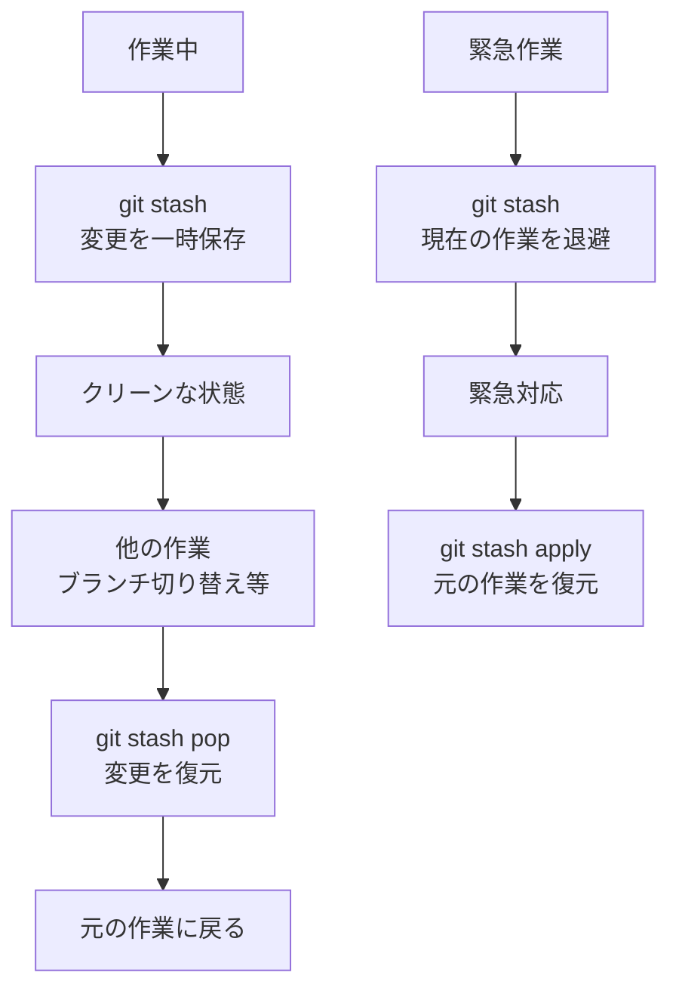
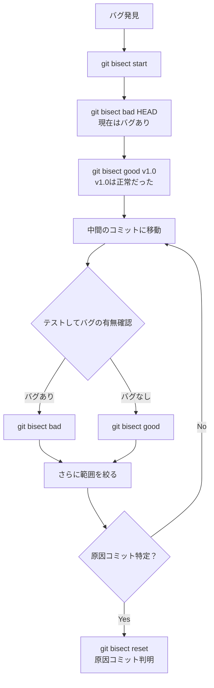

# 05. その他の重要コマンド - 応用的なGit操作

Git の基本操作に慣れた後に覚えておくべき重要なコマンドについて説明します。これらのコマンドは日常的な開発作業を効率化し、複雑な状況に対処するために必要です。

## 📋 目次

- [git cherry-pick - 特定コミットの適用](#git-cherry-pick---特定コミットの適用)
- [git stash - 一時的な変更の保存](#git-stash---一時的な変更の保存)
- [git reflog - 操作履歴の確認と復旧](#git-reflog---操作履歴の確認と復旧)
- [git tag - バージョンタグの管理](#git-tag---バージョンタグの管理)
- [git clean - 不要ファイルの削除](#git-clean---不要ファイルの削除)
- [git bisect - バグの原因調査](#git-bisect---バグの原因調査)

---

## git cherry-pick - 特定コミットの適用

### 📖 概要
他のブランチから特定のコミットだけを現在のブランチに適用します。ブランチ全体をマージせずに、必要な変更のみを取り込めます。

### 💡 基本的な使い方

```bash
# 特定のコミットを適用
git cherry-pick commit-hash

# 複数のコミットを適用
git cherry-pick commit1 commit2 commit3

# 範囲を指定して適用
git cherry-pick commit1..commit3

# マージコミットを cherry-pick（親を指定）
git cherry-pick merge-commit -m 1

# コミットを作成せずステージングのみ
git cherry-pick --no-commit commit-hash

# cherry-pick の中止
git cherry-pick --abort

# cherry-pick の継続（コンフリクト解決後）
git cherry-pick --continue
```

### 🌳 cherry-pick の動作例

```mermaid
gitgraph
    commit id: "A"
    commit id: "B"
    branch feature
    checkout feature
    commit id: "C"
    commit id: "D" type: HIGHLIGHT
    commit id: "E"
    checkout main
    commit id: "F"
    commit id: "G"
    commit id: "D'" type: HIGHLIGHT
```

```bash
# 状況：feature ブランチのコミット D のみを main に適用したい
main:    A---B---F---G
feature:      \
               C---D---E

# cherry-pick 実行
git checkout main
git cherry-pick D

# 結果：D の変更が main に適用される
main:    A---B---F---G---D'
feature:      \
               C---D---E
```

### 📝 実践的な使用例

```bash
# ホットフィックスを複数ブランチに適用
git checkout main
git cherry-pick hotfix-commit

git checkout develop
git cherry-pick hotfix-commit

# 特定の機能のみを先行リリース
git checkout release-branch
git cherry-pick feature-commit1 feature-commit2

# バックポート（新しいバージョンの修正を古いバージョンに適用）
git checkout v1.x-branch
git cherry-pick security-fix-commit
```

### ⚠️ cherry-pick の注意点

1. **コンフリクトの可能性**: 適用先のコードと競合する場合がある
2. **重複コミット**: 後でブランチをマージすると同じ変更が重複する
3. **依存関係**: cherry-pick したコミットが他のコミットに依存している場合

---

## git stash - 一時的な変更の保存

### 📖 概要
作業中の変更を一時的に保存し、後で復元できます。ブランチ切り替えやpullの前に未完了の変更を退避する際に使用します。

### 💡 基本的な使い方

```bash
# 現在の変更を stash に保存
git stash
git stash push  # 同じ

# メッセージ付きで保存
git stash push -m "作業中のログイン機能"

# 特定のファイルのみ stash
git stash push filename.txt

# 未追跡ファイルも含めて stash
git stash push -u
git stash push --include-untracked

# stash の一覧表示
git stash list

# 最新の stash を適用（stash は残る）
git stash apply

# 特定の stash を適用
git stash apply stash@{2}

# 最新の stash を適用して削除
git stash pop

# stash の内容を確認
git stash show
git stash show -p  # 詳細な差分

# stash を削除
git stash drop
git stash drop stash@{1}

# すべての stash を削除
git stash clear
```

### 🔄 stash の動作フロー



### 📝 実践的な使用例

```bash
# 典型的な使用パターン
git stash                    # 現在の作業を退避
git checkout hotfix-branch   # 緊急修正ブランチに移動
# 緊急修正作業...
git checkout main           # 元のブランチに戻る
git stash pop              # 退避した作業を復元

# プルする前の準備
git stash                  # 作業を退避
git pull origin main       # 最新版を取得
git stash pop             # 作業を復元

# 作業の分割
git stash push -m "機能A"   # 機能Aを退避
# 機能Bを実装・コミット
git stash apply            # 機能Aを復元
```

### 🗂️ stash の管理

```bash
# stash の一覧表示例
git stash list
# stash@{0}: WIP on main: 1234567 最新の作業
# stash@{1}: On feature: 作業中のログイン機能
# stash@{2}: WIP on main: abcdefg 古い作業

# 特定の stash の詳細確認
git stash show stash@{1}
git stash show stash@{1} -p

# 不要な stash の削除
git stash drop stash@{2}
```

---

## git reflog - 操作履歴の確認と復旧

### 📖 概要
Git で行った操作の履歴を表示します。reset や rebase で失ったコミットの復旧、誤った操作の取り消しに非常に有効です。

### 💡 基本的な使い方

```bash
# 操作履歴の表示
git reflog

# 特定ブランチの履歴
git reflog branch-name

# より詳細な情報
git reflog --pretty=fuller

# 最近のN件のみ表示
git reflog -10

# 期間を指定
git reflog --since="1 hour ago"
git reflog --until="2 days ago"

# 特定の操作タイプのみ
git reflog --grep="merge"
```

### 📝 reflog 出力の読み方

```bash
git reflog
# a1b2c3d (HEAD -> main) HEAD@{0}: commit: 新機能を追加
# b2c3d4e HEAD@{1}: pull: Fast-forward
# c3d4e5f HEAD@{2}: checkout: moving from feature to main
# d4e5f6g HEAD@{3}: commit: バグ修正
# e5f6g7h HEAD@{4}: reset: moving to HEAD~1
# f6g7h8i HEAD@{5}: commit (amend): コミットメッセージ修正
```

- **左端のハッシュ**: その時点でのコミットID
- **HEAD@{N}**: 操作の番号（0が最新）
- **右端**: 実行された操作の説明

### 🔧 reflog を使った復旧作業

#### 間違った reset の復旧
```bash
# 問題：間違って重要なコミットを reset してしまった
git reset --hard HEAD~5  # 間違い！

# 解決：reflog で削除前の状態を確認
git reflog
# 1234567 HEAD@{0}: reset: moving to HEAD~5
# abcdefg HEAD@{1}: commit: 削除されてしまった重要なコミット

# 削除前の状態に復旧
git reset --hard abcdefg
```

#### 削除したブランチの復旧
```bash
# 問題：間違ってブランチを削除してしまった
git branch -D important-feature  # 間違い！

# 解決：削除したブランチの最後のコミットを探す
git reflog --grep="important-feature"
# または全体を確認
git reflog | grep important-feature

# ブランチを復旧
git checkout -b important-feature commit-hash
```

#### 間違った rebase の復旧
```bash
# 問題：rebase でコミットが壊れてしまった
git rebase main  # 何かがおかしくなった

# 解決：rebase 前の状態に戻る
git reflog
# 1234567 HEAD@{0}: rebase finished: returning to refs/heads/feature
# abcdefg HEAD@{1}: rebase: コミット3
# cdefghi HEAD@{2}: rebase: コミット2
# efghijk HEAD@{3}: rebase: コミット1
# 9876543 HEAD@{4}: checkout: moving from feature to main

# rebase 前の状態に復旧
git reset --hard 9876543
```

---

## git tag - バージョンタグの管理

### 📖 概要
特定のコミットにタグ（目印）を付けて、リリースバージョンやマイルストーンを管理します。

### 💡 基本的な使い方

```bash
# 軽量タグの作成（現在のコミットに）
git tag v1.0.0

# 特定のコミットにタグ
git tag v1.0.0 commit-hash

# 注釈付きタグの作成（推奨）
git tag -a v1.0.0 -m "Version 1.0.0 release"

# タグ一覧の表示
git tag
git tag -l "v1.*"  # パターンマッチ

# タグの詳細情報
git show v1.0.0

# タグの削除
git tag -d v1.0.0

# リモートにタグをプッシュ
git push origin v1.0.0
git push origin --tags  # すべてのタグ

# リモートのタグを削除
git push origin --delete v1.0.0
```

### 📝 タグの実践的な使用

```bash
# セマンティックバージョニング
git tag -a v1.0.0 -m "初回リリース"
git tag -a v1.0.1 -m "バグ修正"
git tag -a v1.1.0 -m "新機能追加"
git tag -a v2.0.0 -m "破壊的変更"

# リリース準備の流れ
git checkout main
git pull origin main
git tag -a v1.2.0 -m "Release v1.2.0"
git push origin v1.2.0

# 特定バージョンのチェックアウト
git checkout v1.0.0
git checkout -b hotfix-v1.0.1 v1.0.0
```

---

## git clean - 不要ファイルの削除

### 📖 概要
Gitで追跡されていない不要なファイルやディレクトリを削除します。

### 💡 基本的な使い方

```bash
# 削除対象ファイルの確認（実際には削除しない）
git clean -n
git clean --dry-run

# 未追跡ファイルを削除
git clean -f

# 未追跡ディレクトリも削除
git clean -fd

# .gitignore で無視されているファイルも削除
git clean -fx

# インタラクティブモード
git clean -i

# 特定のパターンのみ削除
git clean -f "*.tmp"
```

### ⚠️ clean の注意点

```bash
# ❌ 危険：いきなり削除しない
git clean -f  # ファイルが失われる可能性

# ✅ 安全：まず確認してから削除
git clean -n  # 削除対象を確認
git clean -f  # 問題なければ削除
```

---

## git bisect - バグの原因調査

### 📖 概要
バイナリサーチを使用してバグが混入したコミットを効率的に特定します。

### 💡 基本的な使い方

```bash
# bisect 開始
git bisect start

# 悪いコミット（バグがある）を指定
git bisect bad [commit-hash]

# 良いコミット（バグがない）を指定
git bisect good [commit-hash]

# 現在のコミットの状態を報告
git bisect good  # このコミットは正常
git bisect bad   # このコミットはバグあり

# bisect 終了
git bisect reset
```

### 🔍 bisect の動作フロー



### 📝 bisect の実践例

```bash
# 1. バグの発見
# 現在（HEAD）でバグがあることを確認
# v2.0.0 では正常だったことを思い出す

# 2. bisect 開始
git bisect start
git bisect bad HEAD      # 現在はバグあり
git bisect good v2.0.0   # v2.0.0は正常

# 3. Gitが中間のコミットを選択
# "Bisecting: 15 revisions left to test after this"

# 4. テストの繰り返し
# プログラムをテストして結果を報告
git bisect good  # または git bisect bad

# 5. 最終的に原因コミットが特定される
# "abc123 is the first bad commit"

# 6. 終了
git bisect reset
```

## 🔗 コマンドの組み合わせ例

### 緊急ホットフィックスの流れ
```bash
# 1. 現在の作業を退避
git stash push -m "作業中の新機能"

# 2. ホットフィックス用ブランチ作成
git checkout -b hotfix-security main

# 3. 修正作業とコミット
# ... 修正作業 ...
git commit -m "security: Fix vulnerability"

# 4. mainブランチに修正を適用
git checkout main
git cherry-pick hotfix-security

# 5. リリースタグ作成
git tag -a v1.0.1 -m "Security hotfix"

# 6. 元の作業に戻る
git checkout develop
git stash pop

# 7. 不要なブランチを削除
git branch -d hotfix-security
```

### 失敗した作業の復旧
```bash
# 1. 状況確認
git reflog
git status

# 2. 必要に応じて stash
git stash

# 3. 正常な状態に復旧
git reset --hard HEAD@{3}  # reflogで確認した安全な状態

# 4. 不要ファイルをクリア
git clean -fd

# 5. 作業再開
git stash pop  # 必要であれば
```

## 📚 次のステップ

これらの応用コマンドに慣れたら、次のステップに進みましょう：

### 高度なGit機能
- **[Submodule操作](06-submodule-operations.md)** - 複数リポジトリの統合管理

### 実践練習
- **[実習用サンプルファイル](../practice/)** - 実際にコマンドを試してみましょう