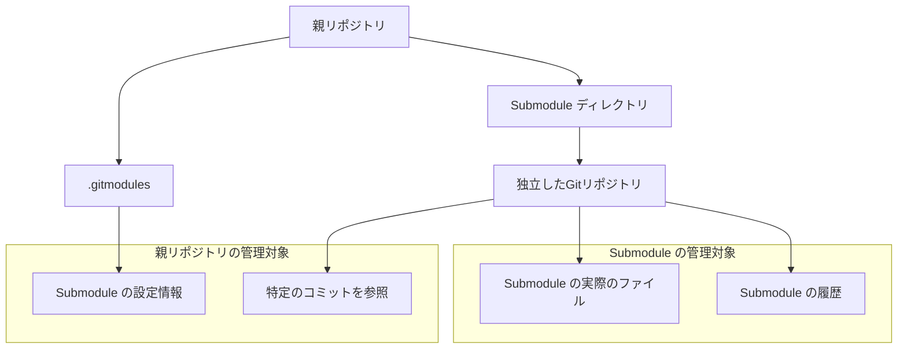
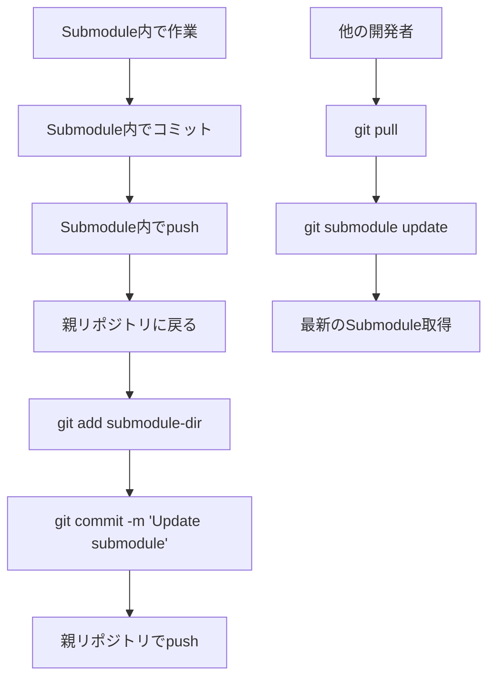

# 06. Submodule操作とプロジェクト管理 - 複数リポジトリの統合管理

Git Submodule は、一つのGitリポジトリ内に別のGitリポジトリを含める仕組みです。大規模プロジェクトでライブラリや共通コンポーネントを管理する際に非常に有用です。

## 📋 目次

- [Submodule の基本概念](#submodule-の基本概念)
- [Submodule の追加と初期化](#submodule-の追加と初期化)
- [Submodule の更新と同期](#submodule-の更新と同期)
- [Submodule での作業](#submodule-での作業)
- [実践例：練習プロジェクトでの活用](#実践例練習プロジェクトでの活用)
- [トラブルシューティング](#トラブルシューティング)

---

## Submodule の基本概念

### 📖 Submodule とは
**別のGitリポジトリを親リポジトリ内のサブディレクトリとして組み込む仕組み**

### 🎯 主な用途

| 用途 | 説明 | 例 |
|------|------|-----|
| **ライブラリ管理** | 外部ライブラリを特定バージョンで固定 | UIフレームワーク、ユーティリティライブラリ |
| **共通コンポーネント** | 複数プロジェクト間での共通コード | 認証システム、ログライブラリ |
| **ドキュメント分離** | ドキュメントを別リポジトリで管理 | マニュアル、API仕様書 |
| **環境分離** | 開発環境と本番環境のコード分離 | 設定ファイル、テストデータ |

### 🌳 Submodule の構造



---

## Submodule の追加と初期化

### 💡 基本的な操作

#### 新しいSubmoduleの追加
```bash
# 基本的な追加
git submodule add <repository-url> <directory-path>

# 特定のブランチを指定
git submodule add -b <branch-name> <repository-url> <directory-path>

# 例：練習用プロジェクトの場合
git submodule add ./practice practice
```

#### Submoduleの初期化
```bash
# リポジトリクローン後にSubmoduleを取得
git submodule init
git submodule update

# または一括で実行
git submodule update --init

# 再帰的にSubmodule内のSubmoduleも取得
git submodule update --init --recursive
```

#### クローン時にSubmoduleも同時取得
```bash
# クローン時にSubmoduleも一緒に取得
git clone --recurse-submodules <repository-url>

# 既存のクローンでSubmoduleを追加取得
git submodule update --init --recursive
```

### 📝 .gitmodules ファイル

Submoduleの情報は `.gitmodules` ファイルに記録されます：

```ini
[submodule "practice"]
    path = practice
    url = ./practice
    branch = main
```

---

## Submodule の更新と同期

### 🔄 Submoduleの更新

#### 特定のSubmoduleを最新に更新
```bash
# Submoduleディレクトリに移動して更新
cd practice
git fetch
git checkout main
git pull origin main
cd ..

# 親リポジトリで変更をコミット
git add practice
git commit -m "Update practice submodule to latest"
```

#### 全Submoduleを一括更新
```bash
# 全Submoduleを最新のコミットに更新
git submodule update --remote

# 特定のSubmoduleのみ更新
git submodule update --remote practice

# 更新後にコミット
git add .
git commit -m "Update all submodules to latest"
```

#### Submoduleの状態確認
```bash
# Submoduleの状態一覧
git submodule status

# 詳細な状態確認
git submodule foreach git status

# Submoduleの変更確認
git diff --submodule
```

### 📊 Submodule更新のワークフロー



---

## Submodule での作業

### 🛠️ Submodule内での開発

#### Submodule内でのブランチ作業
```bash
# Submoduleディレクトリに移動
cd practice

# 現在の状態確認（detached HEADの可能性）
git branch

# 適切なブランチにチェックアウト
git checkout main

# 新しいブランチで作業
git checkout -b feature-new-exercise

# 作業とコミット
# ファイル編集...
git add .
git commit -m "Add new exercise for advanced users"

# Submoduleリポジトリにプッシュ
git push origin feature-new-exercise
```

#### 親リポジトリでのSubmodule参照更新
```bash
# 親リポジトリに戻る
cd ..

# Submoduleの変更を親リポジトリに反映
git add practice
git commit -m "Update practice submodule: Add new exercise"
git push origin main
```

### ⚠️ Detached HEAD の注意点

Submoduleは特定のコミットを参照するため、デフォルトでは **detached HEAD** 状態になります：

```bash
# Submodule内での状態確認
cd practice
git branch
# * (HEAD detached at 1234567)
#   main

# ブランチにチェックアウトしてから作業
git checkout main
# または
git checkout -b new-feature
```

---

## 実践例：練習プロジェクトでの活用

### 🧪 現在のプロジェクトをSubmodule構成に変更

#### ステップバイステップガイド

**1. 前提条件の確認**
```cmd
# プロジェクトルートディレクトリにいることを確認
dir

# 必要なディレクトリが存在することを確認
# - docs (ドキュメントディレクトリ)
# - practice (練習用ディレクトリ)
```

**2. 親リポジトリの準備**
```cmd
# 現在のディレクトリでGitリポジトリを初期化（まだの場合）
git init

# ドキュメントファイルをステージング
git add README.md docs/ .gitignore

# 初期コミット
git commit -m "Initial commit: Add Git learning documentation"
```

**3. practice ディレクトリの独立リポジトリ化**
```cmd
# practice ディレクトリに移動
cd practice

# 独立したGitリポジトリとして初期化
git init
git add .
git commit -m "Initial practice repository with exercises and guides"

# 親ディレクトリに戻る
cd ..
```

**4. practice をSubmoduleとして追加**
```cmd
# 現在の practice ディレクトリを直接Submoduleとして追加
git submodule add ./practice practice

# Submodule追加をコミット
git add .gitmodules practice
git commit -m "Add practice directory as submodule"
```

**5. Submoduleの初期化と更新**
```cmd
# Submoduleの初期化
git submodule init

# Submoduleの更新
git submodule update

# 設定確認
git submodule status
```

#### リモートリポジトリを使用する場合（推奨）

より本格的な運用をする場合：

```cmd
# Step 3の後、practice ディレクトリをリモートにプッシュ
cd practice
git remote add origin <practice-repository-url>
git push -u origin main
cd ..

# ローカルのpracticeディレクトリを削除してリモートからSubmodule追加
rmdir /s /q practice
git submodule add <practice-repository-url> practice
git add .gitmodules practice
git commit -m "Add practice directory as submodule from remote repository"
```

### 📋 日常的な開発ワークフロー

#### 学習者の視点
```bash
# 1. リポジトリのクローン
git clone <main-repo-url> git-learning
cd git-learning

# 2. Submoduleの初期化
git submodule init
git submodule update

# 3. 練習環境のセットアップ
cd practice
scripts\setup-practice-repo.bat
cd temp-repo

# 4. 学習開始
# ドキュメントを読みながら実際にGitコマンドを練習
```

#### コンテンツ管理者の視点
```bash
# 1. ドキュメントの更新
# docs/ ディレクトリのファイルを編集
git add docs/
git commit -m "Update documentation: Add new examples"

# 2. 練習用コンテンツの更新
cd practice
git checkout main
# ファイルを編集...
git add .
git commit -m "Add new practice scenarios"
git push origin main

# 3. 親リポジトリの更新
cd ..
git add practice
git commit -m "Update practice submodule with new scenarios"
git push origin main
```

---

## Submodule の高度な操作

### 🔧 設定のカスタマイズ

#### ブランチ追跡の設定
```bash
# Submoduleが特定のブランチを追跡するよう設定
git config -f .gitmodules submodule.practice.branch main

# 設定の確認
git config -f .gitmodules --list
```

#### 更新戦略の設定
```bash
# Submodule更新時にマージする
git config submodule.practice.update merge

# Submodule更新時にリベースする
git config submodule.practice.update rebase
```

### 🗂️ 複数Submoduleの管理

#### 全Submoduleに対する一括操作
```bash
# 全Submoduleの状態確認
git submodule foreach git status

# 全SubmoduleでGitコマンド実行
git submodule foreach git fetch
git submodule foreach git checkout main

# 全Submoduleの更新
git submodule foreach git pull origin main
```

#### 条件付きSubmodule操作
```bash
# 特定の条件でのみコマンド実行
git submodule foreach '
    if [ "$name" = "practice" ]; then
        git checkout main
        git pull origin main
    fi
'
```

---

## トラブルシューティング

### 🚨 よくある問題と解決法

#### 1. Submoduleが空ディレクトリのまま
```bash
# 原因：初期化されていない
# 解決：
git submodule init
git submodule update
```

#### 2. Submodule内の変更が反映されない
```bash
# 原因：親リポジトリでSubmoduleの参照が更新されていない
# 解決：
cd submodule-directory
git add .
git commit -m "Changes in submodule"
cd ..
git add submodule-directory
git commit -m "Update submodule reference"
```

#### 3. Detached HEAD状態での混乱
```bash
# 原因：Submoduleが特定のコミットを参照
# 解決：適切なブランチにチェックアウト
cd submodule-directory
git checkout main  # または適切なブランチ
```

#### 4. Submoduleの削除
```bash
# 1. .gitmodulesからエントリを削除
git config -f .gitmodules --remove-section submodule.practice

# 2. .git/configからエントリを削除
git config --remove-section submodule.practice

# 3. ディレクトリを削除
rm -rf practice

# 4. gitの管理から除外
git rm --cached practice

# 5. 変更をコミット
git add .gitmodules
git commit -m "Remove practice submodule"
```

### 💡 ベストプラクティス

#### ✅ 推奨事項
```bash
# 1. 常に特定のタグやリリースを参照
git submodule add -b v1.0.0 <repo-url> <path>

# 2. 定期的なSubmodule更新
git submodule update --remote --merge

# 3. 明確なコミットメッセージ
git commit -m "Update library-name submodule to v1.2.3"

# 4. .gitmodulesファイルのバージョン管理
git add .gitmodules
```

#### ❌ 避けるべき事項
```bash
# 1. Submodule内で直接mainブランチにコミット
# → フィーチャーブランチを使用

# 2. Submoduleの更新を忘れる
# → 自動化やチェックリストを活用

# 3. detached HEADで作業
# → 必ずブランチにチェックアウト
```

---

## 🔗 関連コマンド一覧

| コマンド | 説明 |
|---------|------|
| `git submodule add <url> <path>` | Submoduleを追加 |
| `git submodule init` | Submoduleを初期化 |
| `git submodule update` | Submoduleを更新 |
| `git submodule status` | Submoduleの状態確認 |
| `git submodule foreach <command>` | 全Submoduleでコマンド実行 |
| `git submodule update --remote` | リモートの最新に更新 |
| `git clone --recurse-submodules` | Submodule込みでクローン |

## 📚 次のステップ

Submoduleの基本を理解したら、実際にこのプロジェクトをSubmodule構成に変更して、複数リポジトリでの開発体験を積んでみましょう。